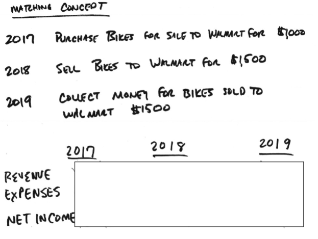
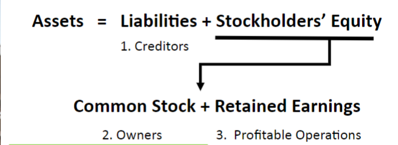
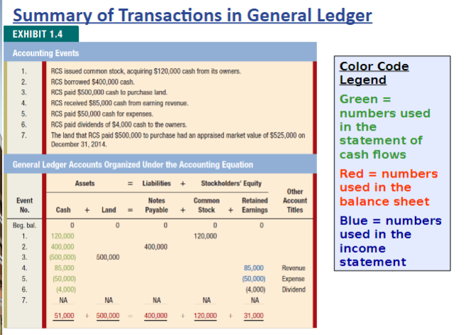
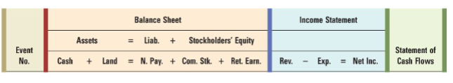
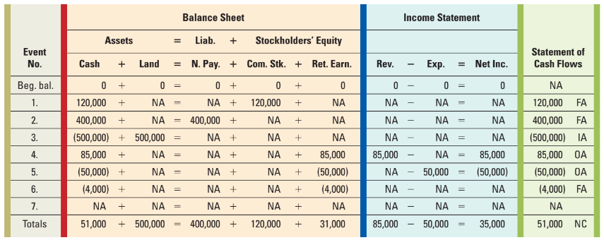

## Announcements

- HW Set #1 posted, due Tues 4/18 by begg of class submit on Canvas
- Check website periodically

## Review

- Assets = Liabilities + Stockholder's Equity
- Revenue - All Expenses = Net Income
- Generally Accepted Accounting Principles
- Gross Margin = Revenue - Cost of goods sold
  - intermediate 

### Income Statement

- Revenue - All Expenses = Net Income
- Reports how much profit (or loss) was generated in a particular period
- Matching concept: according to GAAP, company has to match revenue **earned** (not neccessarily cash collected) with the expenses that generated revenue
- How much expense was **incurred** (not necessarily cash spent) to generate the revenue?

## Ch2 - Structure & Interrelationship of Financial Statements

- Cash vs Non-cash transactions
- Accrual method: transactions are recorded when an economic event has occurred or **value has been exchanged** (not neccesarily when cash changes hands)
  - Business: most trasactions do not involve exchanging cash in the moment.
  - Credit is extended (utility bill / credit card)
  - Apple/Best Biy examples of $1M and 30 day payment terms
- Recognition and Realization - can be 2 transactions
  - Recognize the event/record the transaction
  - Realize the cash later/record the transaction

### Matching Concept

- Bash basis accounting can DISTORT measurement of net income
  - fails to roperly matach revenus earned w/ expenses incurred
  - key words: EARNED and INCURRED

- Cash is not always receive or paid in the period when revenue earned/expenses incurred

- Cash $\ne$ net income

- Objective of accrual accounting: improve matching of revenues w/ expenses from a GAAP perspective

- Fortunately, consistent across companies

Expectation:
- Expenses: 2017
- Revenue: 2018

Actual:
- Expenses: 2018
- Revenue: 2018

-- GAAP is weird 

### Balance Sheet

What is owned and owed (has to BALANCE)

### Statement of Cash Flows

3 types of cash flows [inflows (+) / outflows (-)]
- operating
- investing
- financing

### Financial Statements

What do companies report in real life?

- Quarterly and Annual Reports are published and sent to SEC and posted by SEC for Public Companies
    1. Financial Statements
    2. Footnotes to financial statements
    3. Managemnet's Discussion and Analysis (MD&A)

> SEC : Security and Exchange Commission

Accounting Equation - Components
- Assets: economic resources used by business to produce revenut and profit
- Liabilities: obligations of a business that can be settled by using assets, providing goods or services, or accepting oher obligations
- Stockholder's Equity: portion of assets remaining after creditor's claims have been satisfied

**Assets = Liabilities + Stocholders' Equity**

#### Derivation of Accounting Equation

- Based on 2 funding sources for assets. Funding parties have claims on the assets.

- Can express Accounting Equation as Assets = Claims

- i.e. money/financial resources for assets is provided by either creditors or investors
  - Creditors: liabilities, company owes this and is an obligation as they need to repay the creditors
  - Investors/owners: equity, company owns this, no repayment needed

Assets of business have claims by creditors and investors/owners
- creditors: repaid
- owners: share profits

> Where does money/funding come from?

Business obtain/generate assets/fund the business from 3 sources
1. Creditors
2. Owners
3. Profitable Operations

## Learning Objectives 3 & 4

3. Record business events in a general ledger accounts organized under the accounting equation
4. Classify business events as asset source, asset use, or asset exchange transactions.

### Recording Accountign Events
- accounting event: economic occurrence that change assets/liabilities/stockholders' equity of a business

> All transactions impact the balance sheet, at least

### Classification of accounting events
- Asset Source Transaction: increase total amount of assets /increase total amount of claims. Balance Sheet value ++
- Asset exchange transaction: decrease one asset and increase another asset. Balance Sheet value neutral
- Asset use transaction: decrease total amount of assets and total amount of claims. Balance Sheeet value --

### Recording Business Events or Transactions under Accounting Equation
- Multiple accounts in each component of the Balance sheet

THIS IS NOT AN EFFICIENT WAY TO TAKE NOTES

> dividends are NOT part of the income statment. It's not part of their business

Event 7: this is why they're called events, not transactions
- appraised market value increased: +$25,000
- no transaction!

Historical Cost Concept: Requires that most assets be reported at the amount paid for them (historical cost) regardless of increases in market value.
- Perfect: No
- Consistent: Yes

### Summary - Classification of accounting events
- asset source: BS + 
- asset exchange: BS 0 
- asset use: BS - 

## Learning Objective 5

5. Use the general ledger account information to prepare financial statements.

### Transactions in General Ledger
- general ledger: repository/database of all accounting transacions in a company
  - data organized by account
  - each event balances
- summary contains balances in general ledger at end of period (financial statemenets will be constructed)

- recall: dividends are not recorded in income statements

#### Preparing Financial Statements: Income Statement

A    | $
--- | ---
Rental Revenue | 85,000
Operating expenses | (50,000)
Net income | 35,000

- Matching Concept
- Net Income/Loss
  - Loss results when expenses exceed revenues
- Accounting Period

> Income is measured for a span of time called the **accounting period**

#### Preparing Financial Statments: Balance Sheet

Assets | $
--- | ---
Cash | 51,000
Land | 500,000

Total Assets: $551,000

Liabilities | $
--- | ---
Notes payable | 400,000

Stockholders' Equity | $
--- | ---
Common Stock        | 120,000
Retained Earnings   | 31,000

Total Stockholders' Equity: 151,000
Total Liabilities and stocholder's equity: 551,000

> Assets are displayed in order of liquidity

#### Preparing Financial Statements: Statement of Cash Flows

> TODO: Get the table from readings

- Operating
- Investing
- Financing

## Horizontal Financial Statement Model

New Structure organizes transactions for accounting equations and 3 main financial statements. Expands beyond Accounting Equation/Balance Sheet

> NC means Net Change

## Homework Set #1

- Covers Chp 1-4 (Chp 4 is EC)

### Horizontal 

Assets
- Cash
- 