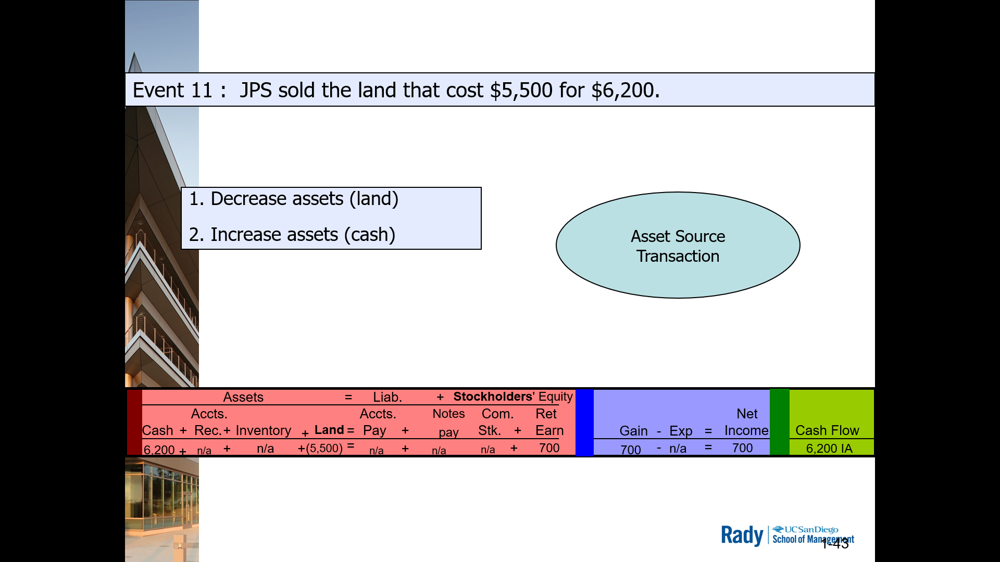

# Chpt 3

Accounting for Merchandising Business + other impo accounting concepts

## Merchandising Business

- Buys/Sells goods to generate revenue
- Other 2 types of Businesses
  - Manufacturing: make/sells producs/goods
  - Service: sells services
- Inventory: goods purchased for resale
  - assets recorded on *balance sheet*

**Learning Objective 1**:  Identify and explain the primary features of perpetual inventory system in accounting

## Perpetual Inventory System

Inventory accoutn is adjusted perpeetually throughout accounting period
- Increases with purchases
- Decreases with sales

Walmart Toaster Example
Event   | Units | $
---     | ---   | ---
Beg Inv | 10    | 10
Purchase| 20    | 20
Available for Sale | 30 | 30
Sell    | (17)  | (17)
End Inv | 13    | 13

## Income Statement

Product Cost
- function of sales: costs start in the **inventory** account on balance sheet
- Become **cost of goods sold** on income statement

Selling & Administrative Costs
- NOT a function of sales: costs are not included in inventory
- sometimes called **period costs** or **OpEx**

## Accounting for Inventory $ 

Inventory (asset) vs Cost of Goods (Expense)

## Gross Margin (or Gross Profit)

Sales/Revenue - Cost of Goods Sold = Gross Margin

- How much profit is made BEFORE OpEx and Taxes?

**Learning Objective 2**: Show the effect of inventory transactions on financial statements

3A + 3B are simultaneous accounting transactions

Classic Revenue Recognition in a Merchanidising company

**matching concept**
- Follow the units

**Learning Objective 3**: Explain the meaning of certain accounting terms used to describe cash discounts and transportation costs.

## Cash Discounts

Prompt Pay: A deduction from the invoice price offered to incentivize early payment

- 2% off the bill if paid within 10 days instead of the 30 day due

## Event Affecting Sales

Sales of inventory often involes
- inventory returns
- purchase allowances like volume discouts
- cash discounts like prompt pay

- key relationship
  - Net sales = Gross Sales - Discounts and Deductions
    - Gross Sales: amount invoiced
    - Net Sales: what is reported anr erepresents expected $ to be collected
  - Companies do not expect to collect 100% of Accounts Receivable

## What hapens to gross margin when there is:

Inventory Return?
- Sales/Costs are adjusted downward based on number of units 
- gross margin would decrease

Purchase allowance and cash discounts
- Net sales would be adjusted downwards
- gross margin would decrease

Why do businesses offer allowances and discounts?
- To be competitive, gain more business and build relationships

## Transportation or Freight Costs - FOB

Who ays the freight or shipping costs?

FOB = Free on board // Freight on Board

FOB shipping point: Business (you) pays

FOB destination: Buyer pays

**Learning Objective 4** Show the effect of lost, damaged, returned or stolen inventory on the financial statements

## Lost, Damaged

Most merchandise companies exp some level of loss

Physical Inventory process "normalizes" inventory levels (physically counting the inventory at a point in time)

Any differences b/w recorded perpetual inventory (company records) and physical inventory are recorded or written to INCOME STATEMENT
- Writeup/Writoffs result
  - WriteOff: have LESS than records indicate
  - WriteUp: have MORE than records indicate

WRITEOFF

**Learning Objective 5**: Explain how gains and losses differ from revenues and expenses.

-- Income Statement lists it as "Other income/(expense), net

Historical recording

**Learning Objective 6**: compare and contrast single and multistep income statements

-- prof likes multi-step better,, you don't have to calculate intermediate values yourself

-- ~35% do single-step. Very much a minority

> Restates are bad: If there's smoke, there's usually fire
>
> 99.99% it's an understatement

**Learning Objective 7**: Use common size financial statements to evaluate managerial performance

Looking at financial statements --> make observations

Guessed 5: Walmart based off Inventory

Guessed 4: XOM based off Equipment 

PFE: high OTHER category

MSFT