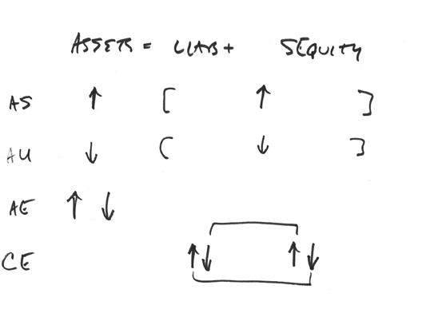

# Chp 2

## Accrual

- Accounting transaction that records 
  - revenues when they are earned or value is delivered
  - expenses when they are incurred
- recognition of revenue earned or expenses incurred before actual money is exchanged
- recorded in the **absence of cash**

> Recognition First --> Realization Second

- Recognition
  - recording economic event/exchagne of value b/w/ 2 parties in financial statements
- Realization
  - Collecting/spending cash, generally from sale or purchasse of products or services

## Deferral

- Pertains to both expenses and revenues
- Opposite of Accrual
- Cash first, Value transfer is second
- Recorded as a "lump"
  - then spread over time period when value is exchagned
  - can be reveue or expense transaction
  - Realization happens first
  - Can be inflow or outflow
- "lump" amt needs to be spread out between two or more accounting periods to reflect the value delivered or received
  - How recognition transaction is recorded in financial statements

## Recording Transactions
- Type of transaction?
  - Asset Source
  - Asset Exchange
  - Asset Use
- How many of the 3 financial statements will it affect
  - Balance Sheet
  - Income Statement
  - Cash Flow Statement

**Claims Exchange Transaction**: "everything happens on the righhand side of the balance sheet"
- 4th type of transaction
- e.g. Value delivered by instructor and consumed by Company
  - Increase liabilities (salaries payable)
  - Decrease stocholder's equity (retained earnings)

## Types of Transactions review

> Need to review the Matching Concept example

## Recording Transactions
- Type of Transaction? (how will it affect balance sheet)
- How many of 3 financial statements will it impact?
  - Income Statement
  - Cash Flow Statement
  - Change in S Equit. Statement

**on account**: Claims Exchange Transaction 
- in the absense of cash 
- no cash flow 
- on credit
- invoice

**Adjusting Entries**:  Accrual to ensure accurate revenue and expense recognition
- Adjust and close out account balances
- Prior to preparing financial statements

> Goal: Capture all value exchanges and reflect on financials.

