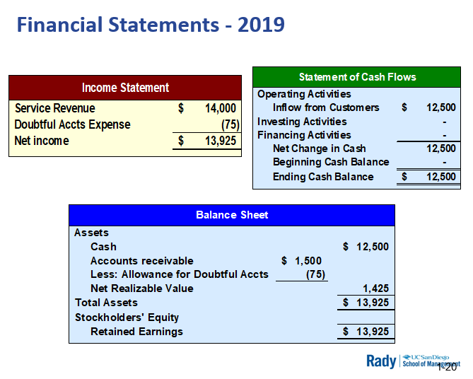
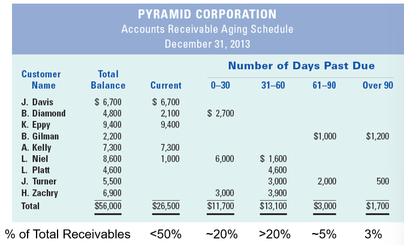
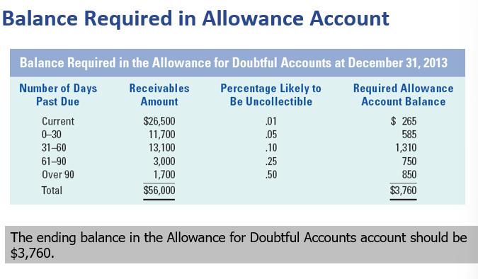
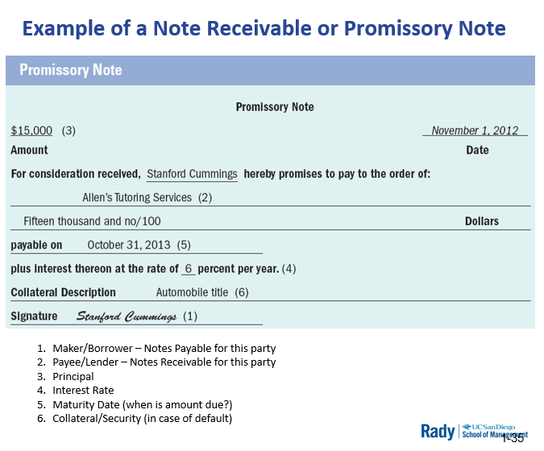
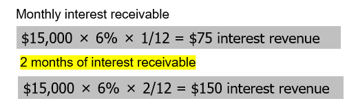
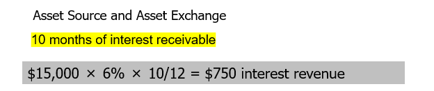
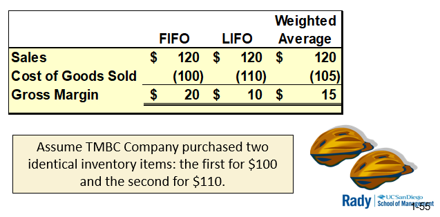
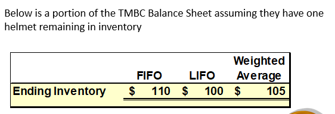
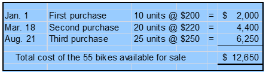
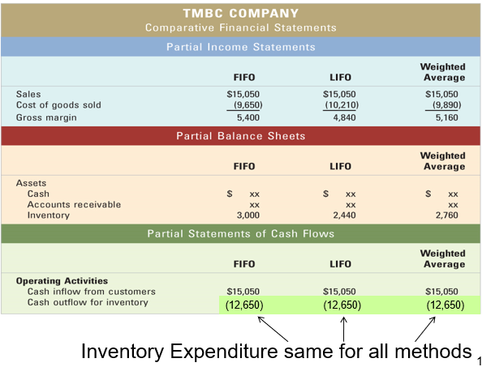

# Chp 5: Receivables and Inventory and Current Assets

**Current Assets**: convertible to cash within a year

Receivables (IOUs due to the company)
- Result from Revenue Trasactions **on account**
- 1 step removed from cash
- important indicator fo company's revenue and wuality of profitability
- Net Sales should = expected collections
  - collections need to follow sales
  - Flowthrough to cash is important!
- Can't spend receivables. Worthless if not collectible
- Cash is king.

Inventory
- Inventory ties us cash, 2 steps removed from cash
- It's best if proper amt of inventory move quickly through company so it can be converted to cash
- Eventually turns into Cost of Goods when it is sold

## Learning Objectives

1. Explain how **allowance method** of accounting for **doubtful accounts** affects financial statements
2. Determine doubtful accounts expense using the **percent of revenue** method.
3. Determine doubtful accounts expense using the **percent of receivables** method
4. Explain how accounting for **notes receivable** affects financial statements
5. Explain how accounting for **credit card sales** affects financial statements
6. Explain how different **inventory cost flow methods** affect financial statements (a taste of managerial accounting)
   - specific identification
   - FIFO
   - LIFO
   - weighted avg

## Net Realizable Value of Accounts Receivables

Amount of receivables a company estimates it will actually collect // cash that will end up in the bank
- deduction reflecting on allowance for doubtful accounts
- reasonable estimate

Gross sales - Normal Deductions = Net Sales (should mirror actual cash flow)
  - prompt pay
  - returns
  - provision for non-collectables $, etc.

Example: Historically, 1-5% of sales $ not collected
- Make allowance for 1-5% in accounting records (3% avg is easily defendable to auditors)

- Event 1: $14,000 service revenue **on account**
  - Gross revenue
  - Assets +14K = Retained Earnings +14K
  - Revenue +14K = Net Income +14K
  - Cash Flow: NA (on account)
- Event 2: Collect $12,500 cash from accts receivable
  - Assets +12.5K + Accounts Rec. (12.5K) = 0
  - Revenue: NA (balance principle)
  - Cash Flow: 12,500 OA
- Event 3: Recognize allowance for doubtful accounts//Bad Debt expense
  - Contra-Asset account: Allowance for doubtful accts.
  - Allowance (75) = Retained Earnings (75)
  - 0 - Expenses 75 = Net Income (75)
  - Cash Flow: NA
    - nothing to subtract since it was never collected

## Percent of Revenue Method

- Event 4: Recognize uncollectible accounts expense for 2020 on revenue generated of $10,000
  - Allowance (135) = Retained Earnings (135)
  - 0 - Expenses 135 = Net Income (135)
  - Cash Flow: NA

## Percent of Receivables Method

Alt. to percent of revenue 

Focus on estimating the most accureate amount for balance sheet account (allowance) and the NNet reliazable value

Likelihood of collection is Inversely Proportional to outstanding time for account receivable
- aging/stratifying amt overdue of accoutns --> classifies all receivables by their due date
- probabilizes collectability of outstandign balances based on how current/late the receivables are
> TL;DR Most stale = least likely to be collected

### Accounts Receivable Aging Schedule

> Common practice: charging interest/fees after due date to:
> - hold clients accountable
> - compensate for allowance for doutbtful accounts based off percent of receivables

Once calculated, get applied to general ledger the same way:
- Allowance (3760) = Retained Earnings (3760)
- 0 - Expenses 3760 = Net Income (3760)
- Cash Flow: NA

## Balances in Allowance Account

Certain items in fin stmt estimated based on info avail. to business

Not a hard science, can involve some "art"

### Income Statement vs Balance Sheet Approach

Percent of revenue method: income statement approach

Percent of receivables method: balance sheet approach

> Either approach provides acceptable results
>
> Depends on business and/or auditor guidance/pref.

## Notes Receivable

Legally documented with a **promissory note**

**Involved Parties**:
- **Payee**: lender
  - loans money to maker
  - expects payment of principal and interest
  - collector
  - asset for this party
- **Maker**: borrower
  - responsible for paying note on due date
  - Payor
  - Liability for this party

**Involved ammounts of $**:
  - **Principal**: amt money loaned
  - **Interest**-economic benefit earned by payee for loaning principal to maker/borrower

**Other aspects**:
  - **Maturity Date**: date on which maker mus repay principal and interest
  - **Collateral**: assets belonging to maker/borrower assigned as security
    - pledged to ensure payment of note

### Accounting for Notes Receivable

- Event 1: Loans $15,000. Due in 1yr w/ 6% APR due by Oct 31, 2013
  - Assets: Cash (15,000) + Note Receivable 15,000 = 0
  - Net Income: NA
    - Investments not considered an expense
    - Context-specific: IF bank, then would be considered operating expense
  - Cash Flow: (15,000) IA

- Event 2: Recognition of interest Revenue
  - End of 2012, accrue interest on notes receivable

  - Int. Rec: 150 = Retained Earnings: 150
  - Int. Income: 150 - 0 = Net Income: 150
  - Cash Flow: NA

- Event 3: Collection of principal + interest on maturity date (Oct 31, 2013)

  - Int. Rec: 750 = Retained Earnings: 750
  - Int. Income: 750 - 0 = Net Income: 750
  - Cash Flow: NA

> Now, record payment of principal and interest receivable
  - Cash +15,900 + Note Rec (15,000) + Int. Rec (900) = 0
  - Net Income: NA
  - Cash Flow: 15,900 IA
    - For a bank, could be OA (context specific)

## Credit Card Sales

Don't have to hassle with collecting
  - deducts a fee (usually 1.5% to 5%) from gross amount of sales 
  - pays merchant the net balance (invoiced sales - credit card fee)
  - pays fee to let other party collect and take collection risk
  - cost beneficial to accept credit card

- Event 1: Accepts credit card payement for service of $1,000. Charged 5% fee of gross sale
  - Asset Source
  - Accounts Receivable +950 = Retained Earnings +950
  - Revenue +1000 -Expenses 50 = Net Income 950
  - Cash Flow: NA

- Event 2: Collects full amt due from credit card co.
  - Asset Exchange
  - Cash +950 + Accoutns Receivable (950) = 0
  - Net Income: NA
  - Cash Flow: 950 OA

## Inventory Cost Flow Methods

4 common methods to calculate how inventory is valued:
- Specific Identification
- FIFO
- LIFO
- Weighted Average

> All about interplay between Balance Sheet and Income Statement

### Specific Identitication

One-by-One record keeping is more practical

Goods are
- high-priced
- low-turnover

### FIFO

First in: cost of items purchased first
First out: assigned to Cost of Goods sold first

Most logical, most popular, chronological

Example: identical helmets bought for $100, then $110
- Assuming same unit price, gross margin item 1 > item 2

### LIFO

Last in: last purchased item
First out: assigned to Cost of Goods sold first

Tax advantages due to normally recording higher cost of goods sooner.

Can be used for new companies/new technologies.

Can help with cash flow

Example: Identical helmets again
- Assuming same unit price, gross margin item 1 < item 2
- More expensive item sold first --> Lower gross margin --> helps with taxes for first transaction

### Weighted Average

Cost of Goods Sold = average cost of items available

Example: Identical helmets again
- $210/2 = $105 each

### Physical Flow vs Accounting Flow

Flow oc costs through accounting records does not need o match the physical flow of goods on shelves

FIFO: mirrors, like milk in grocery store

Think inventory layers...

### Effect of Cost Flow on Income Statement

Method used can significantly affect gross margin report in Income Statement

Example: Identical helmets again, writing an income statement if one helmet is sold:

### Multiple Layers with Multiple Quanities

- 55 bikes
- 3 points in time
- $12,650
- 43 bikes sold
  - method used determines which ones got sold
- 12 bikes remaining in inventory
  - method used determines which ones are kept

- FIFO: CoG avail sale 12,650 (55 bikes) = CoGS 9,650 (43 bikes) + Ending Inventory Balance 3,000 (12)
- LIFO: CoG avail sale 12,650 (55 bikes) = CoGS 10,210 (43 bikes) + Ending Inventory Balance 2,440 (12)
- Weighted Avg: 12,650/55 = 230 each. 12,650 (55 bikes) = CoGS 9,890 (43 bikes @ 230 each) + Ending Inventory 2,760 (12 bikes)

