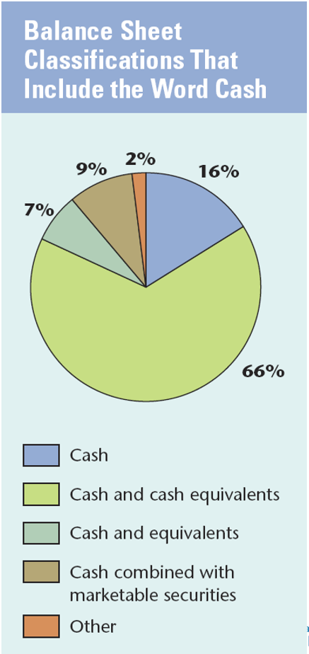
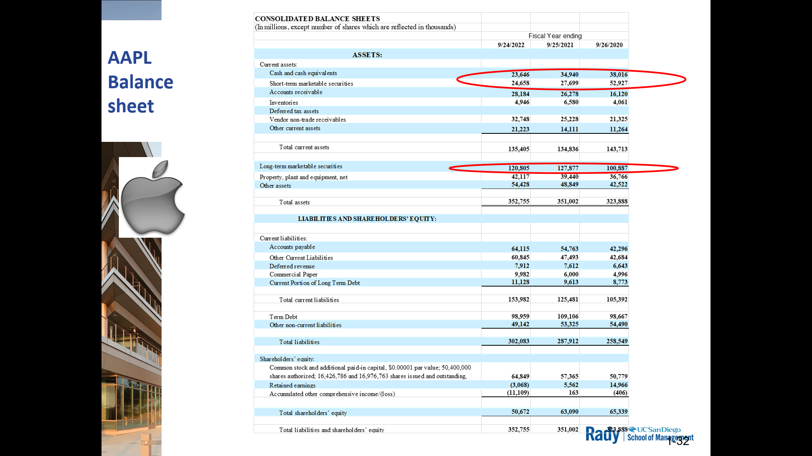
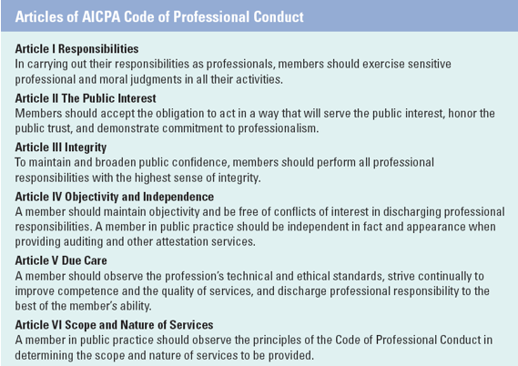

#  Chp 4 - Internal Cotrols, Ethics, & Accounting for Cash

1. ID key elements of strong system for internal controls
2. Accounting for Cash
3. Explain role of ehtics in accounting progression
4. Explain autitor's role in financial reporting

## Enron Bankruptcy

- Enron Energy Co.
- major accounting fraud in 2001
- conseq. --> backruptcy
  - employees lost job
- Toppled oldest accounting firm in the US: Arthur Andersen
- This led to establishing new accounting rules and procedures to protect investors

## Sarbanes Oxley (SOX)

- checks and balances
- internal controls intended to protect assets/items of value in a compnany
- Section 404 requires a statement and sign-off of management's responsibilit for establishing and maintaining adequate internal control over **financial reporting** process by **public** companies

- auditing the processes too, not just the numbers themselves
  - recall: public companies largely communicate to investors via published financial reportings
  - Financial reporting is at the heart of investor communications
  - 2 audits/examinations
    - books/numbers accuracy
    - statement generation processes for consistency

## Key elements to producce accurate & reliable reporting

1. Control Environment
   - demostration of integrity and ethical values in company
   - leadership sets tone to protect valuable assets
2. risk Assessment
   - mgmt ids and tries to understand potential risks to integrity
     - of financial statements
     - and of reporting processj
3. Control Actiities
   - internal controls/actions, procedures & process to ensure
     - accuracy
     - consistency
     - reliability
   - Making and enforcing rules
   - Actual checks and balances
4. Information and Communication
   - effective internal/external reporting relies on communnication of the controls
   - letting people know TODO's and what NOT TODO
5. Monitoring
   - continual 
     - assessment of effectiveness
     - correction of internal controls
   - Is it working? If not - fix it

## Actual Operational Internal Controls

### 1. Separation of duties

Functions shall be performed by separate individuals to prevent corruption:
- authorization
- recording
- custody of assets

Work of one employee can act as a CHECK on the work of another

Example: Separate positions for
- Requestor
- Approver
- Accounts Payable/Invoice Processor
- Disbursor/Payor (money release)

### 2. Quality of Employees

Chain is only as strong as it's weakest link

Business is only as good ast eh people it employs and properly trains

Job rotations is really good
- releive boredom, increase productivity
- keeps employees engaged and sharp
- cross-trained employees w/ ability to substitute for another ==> resistance to distruptions in the workplace
- careful not to overwhelm employees w/ responsibilities ==> might cause risk for business

### 3. Bonded Employees

Bond employees to protect against employee theft and dishonesty via compensation in the event of asset/property loss/damage due to acts of an employee

Employees with access to valuables, bonding protects the organization
- US Mint
- Diamond Mine

Essentially, fidelity bond to provide insurance in case of employee actions

### 4. Required Absenses

All employees whould be required to take regular vacations
- periodic duty rotation
- exposed covered-up fraudulent activity
- prevent burning out

### 5. Procedures Manual

Provide documentation
- references for employees
- periodic inspection by management
- SOX scripts

### 6. Authority and Responsibility

Should provide authority manual
- establish definitive chain fo command
- general/specific authorizations for various responsibility
  - tiers of authority
  - General: rules applicable to ALL members of org
    - e.g. req to fly by coach + buy tickets from specific vendor // all $ requests need approval by superior
  - Specific: Applies to specific position within org
    - e.g. all checks must be cosigned by Controller AND Treasurer

### 7. Prenumbered Documents

Preserves integrity of documents, resistant to unauthorized modification to docs

Used for all important docs:
- checks
- purchase orders
- receiving reports
- invoices

Also helps keep track of all forms issued during particular period

### 8. Physical Control

Secure location for valuable property to avoid misappropriation
- cash 
- checks
- inventory
- intellectual property

Methods
- Serial numbers
- random unannounced tracking inventory counts

### 9. Perforance Evaluation

Independent verification of employee performance, usually:
- annual
- signed off by multiple elvels

Effectiveness of this should be evaluated by auditors
- what happens to people that have low performance?
  - training?
  - let go?

### 10. Limitations

Internal Controls can be circumvented by collusion among employees
- teams of employees might cover up for eachother

Good internal controls & good management
- minimize fraud
- increase likelihood of detection

No system can prevent all fruad

## Accounting for Cash

### Basic Cycle and Internal Controls

Internal Controls for Cash:
- Up to date **signature card** with bank should be maintained
- **Cash receipts** should be recorded immed. upon receipt and disposed daily
- **deposit ticket** should be used for all deposits
- **Cash disbursements** should be made by prenumbered check or wire
- A monthly **bank reconciliation** should be prepared by an independent party
  - comparing the accounting records to the bank records

### Accounting and Protecting Cash

Need to control cash
- easiest target for theft/misuse
- req strict adherence to internal control procedures

Best practice for cash control: make all disbursements using checks/wires
- provides record/audit trail of cash payments

### Classifying Cash on Financial Statements

Most companies combine currency + other payables on demand (cash like) items in single balance sheet account w/ varying titles

Reporting-wise "how much can a commpany write a check for"

Ex: AAPL had $169B in cash & cash equiv., short term marketable securities, and long term marketable securities

## Importance of Ethics

Role of accountant requires
- trust
- credibility

Accounting information worth lies on trustworthiness of accountant

High ethical standards required by profession state "Certified Public Accountants assumes an obligation of self-discipline above and beyond the requirements of laws and regulations"

American Institue of Certified Public Accountants requires members to comply w/ Code of Professional Conduct - 6 articles

### AICPA Code of Progressional Ethics

Governing body for CPAs

- Article I: Responsibilities
- Article II: The public Interest
- Article III: Integrity
- Article IV: Objectivity and Independence
- Article V: Due Care
- Article VI: Scope and Nature of Services

## Role of the Independent Auditor

**Audit process**: how financial analyst know if a company follow GAAP, 

Audit: detailed examination of company's financial statements and udnerlying accounting records

Primary roles:
- Conduct financial audit
- Assume both legal + professional responsibilties 
  - the public
  - company receiving audit services
- Determines if financial statement are **materially correct**
  - not absolutely or precisely correct
    - not splitting the atom

- Maintains professional confidentiality of client records
  - does not exempt auditor from legal obligations such as testifying in court

Essentially, verifying + checking financial records so investors have confidence in numbers/statements

### Materiality and Financial Audits

Auditors do not guaratee absolute correctness but rather:
- material correctness
- free of material mistatement

> Material Item
>
> An error, or other reporting problem, that's large enough to influence the decision making of an average prudent investor.
>
> Context specific

Is missing $1M in sales in a quarter at Apple material?

### Types of Audit pinions

- Unqualified
  - Best - materially correct
  - Grade: B+ / P
- Qualified
  - 2nd Best - auditors have reservations
  - Grade: D
- Disclaimer
  - Not enough info
  - Grade: Incomplete
- Adverse
  - Worst - has material problems
  - Grade: F

## Chp 4 - Final Notes

If you see something, say something fast

You have one reputation, don't ruin it

You can always get another job, but you can't get another reputation

## Quiz Details

- Key Concepts
  - Accounting Equation
  - Types of Transactions
  - 3 main Financial Statements
  - Major components and terms of Financial Statements
  - Gross Margin
  - Net Income
  - Internal Controls, Audits, and Auditors