# Accounting for Liabilities

Accounts tend to have "Payable" in the title

Types of Liabilities:
- **Current**: normally due within one year
  - Accounts Payable
  - Short-Term Notes Payable
  - Wages Payable
  - Taxes Payable
  - Interest Payable
- **Long Term**: due beyond one year
  - Long Term Notes Payable
  - Installment
  - Bonds
  - Deferred or Unearned Revenue
    - could go either way, depending on the deal

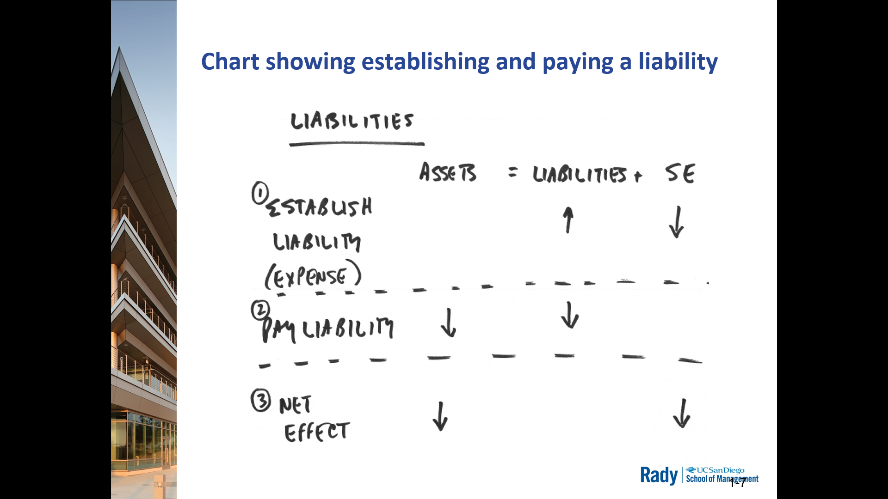

## 1. Show how accounts payable and short-term liabilities affect financial statements 

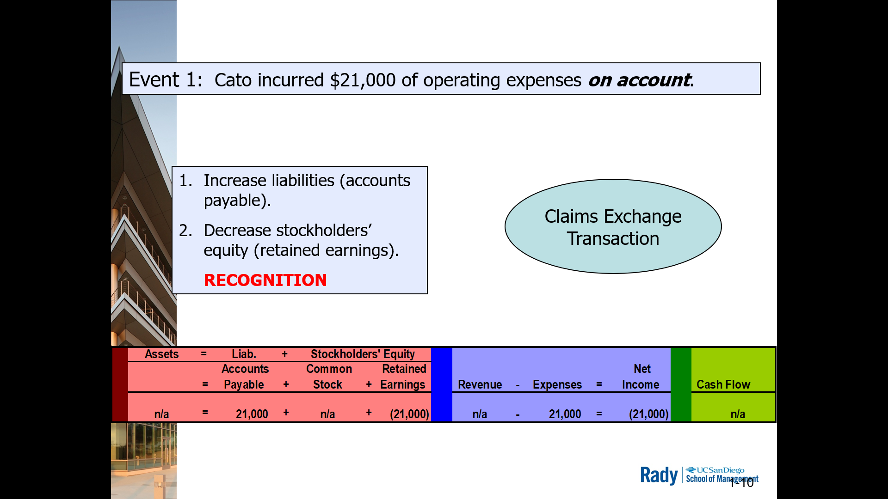

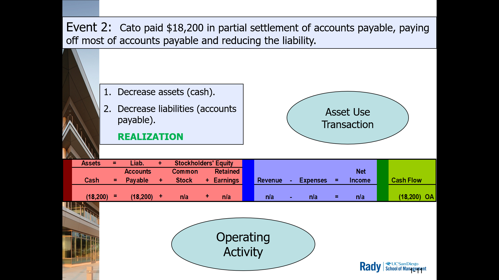

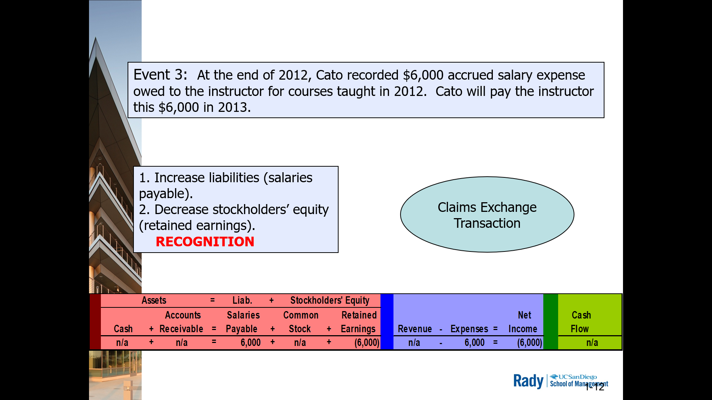

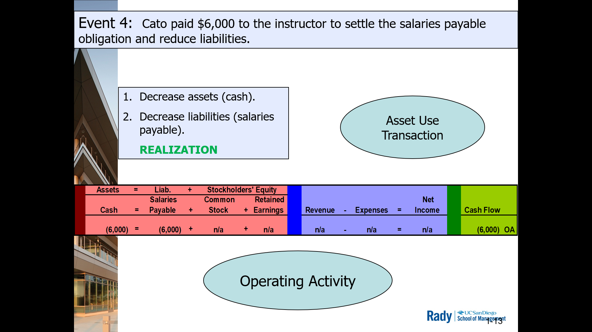

## 2. Show how sales tax liabilities affect financial statements

First step: Set up a liability 

- Most states require retail companies to collect sales tax on items sold to their customers
- Retailers then remites or pays the tax tot he state at regular intervals
- In essense, a retailer collects for the tax authority
- Sales tax is a liability to the retailer until paid to the state

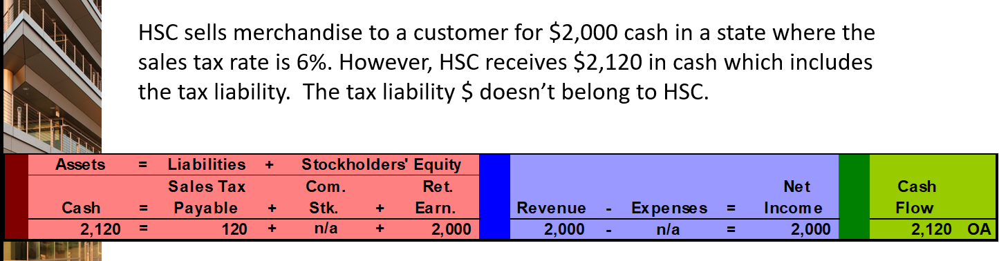

Second step: Pay the liability

- Remitting the tax (paying cash to the state tax authority)
- Asset use
- Both cash and sales tax payable decrease
- Income statement neutral
- Only Balance Sheet and Cash Flow are impacted

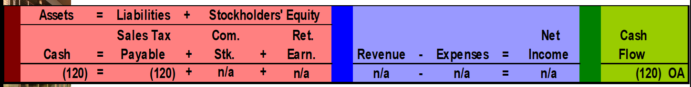

## 4. Show how notes payable and related interest expense affect financial statements.

Company is borrowing money

09/01/12 Borrowing Event
- Sept 1, 2012 HSC borrowed $90K from national bank
- HSC borrower, Nat Bank lender
- HSC has note payable due in one year with Ann. Interest Rate of 9%
- Interest for 12 month period of $8.1K is due 8/31/13

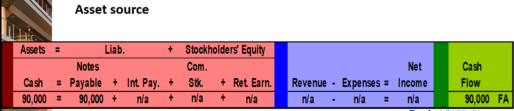

12/31/12 Recognition of Interest Expense
- At end of 2012, HSC must accrue interest incurred on it's note payable
- $90K x 9%/12 month x 4 months = $2.7K interest expense

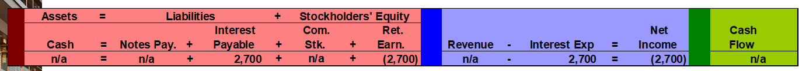

08/31/13 Transaction 1: Recognition of interest expense
- $90K x 8%/12 month x 8 months = $5.4K interest expense

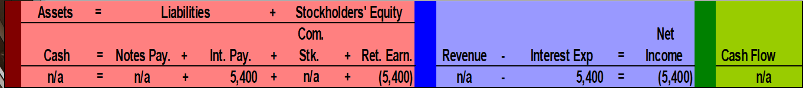

08/31/13 Transaction 2: Payment of principal and interest on the maturity date
- Finally record payment of interest payable and principal. 
  - Asset Use

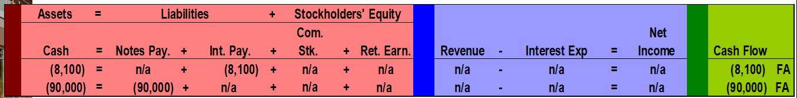

## 3. Define contingent liabilities and explain how they are reported in financial statements.

**Contingent Liability**: potential obligation arising from a past event. An expense that could be looming

- Judgement needs to be applied: think of a lawsuit against your company

- If you're looking at Financials, a good thing to look for
- If you're about to do business w/ company or potentiallhy working for one --> good idea to check for contingient liabilities

- GAAP req companies classify contingent liabilities into 3 diff categories
  - reflects likelihood of becoming actual liabilities

- Quantified
  - probable and estimate
  - recognize in the financial statements
- On radar
  - Reasonably possible (or probable but not estimable)
- No mention
  - Remote
  - Need not recognize or disclose

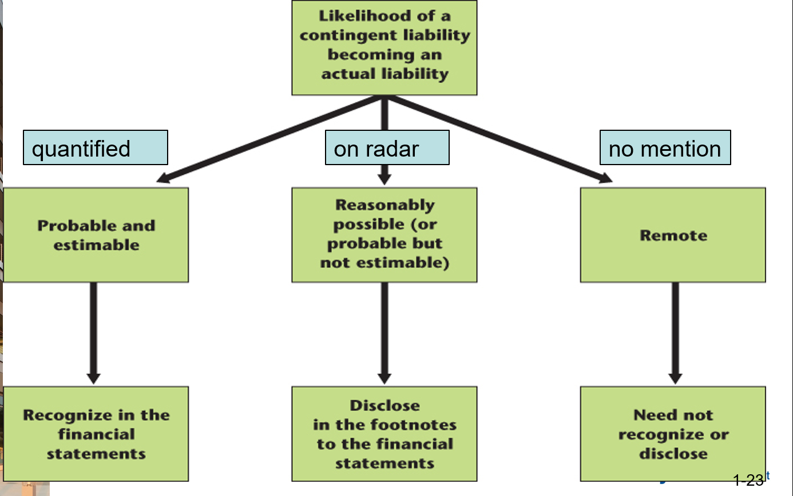

> Evolution of contingent liability in Volkswagon diesel scandal's recognition of a potential of lawsuit.

## 5. Show how installment notes affect financial statements

Long-term installment notes are liabilties that usually have terms from 2 to 5 years

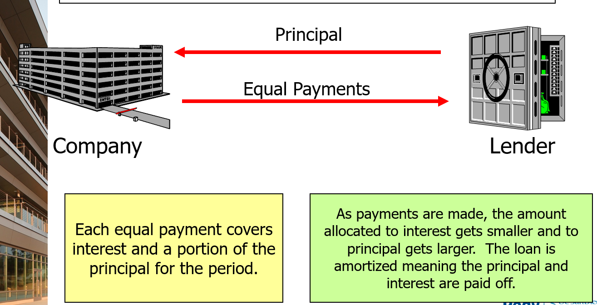

Separating principal and interest within payment

Assuming we know the fixed periodic payment amount:
1. ID the unpaid principal balance
2. Amount applied to interest = Unpaid principal balance x Interest rate (usually monthly)
3. Amount applied to principal = Periodic equal fixed payment - amount applied to interest
4. New unpaid principal balance = Unpaid principal balance - amount applied to principal 

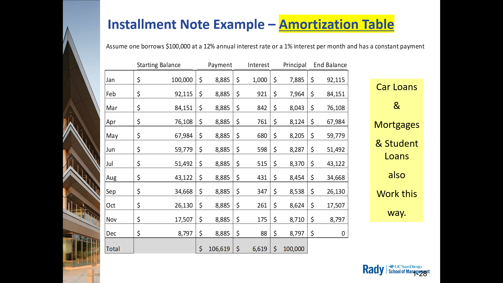

## 6. Explain how to account for bonds and related interest costs

Context:
- Jan 1, 2012 bonds issued by borrower (Mason Co)
- Principal = $100K from creditors
- Stated interest rate = 9%
- Interest Date = when annual interest payments are due to creditors
  - set to 12/31 each year for 5 years
- Maturity Date = Dec 31, 2016 (end of 5th year); Mason pays off $100K principal

Issuing bond 
- Balance: `Assets.Cash` = `Liabilities.Bonds_Payable` 
- Cash Flow + 

Bond interest expense recognition
- Balance: `(Assets.Cash)` = `(Equity.Ret_Earnings)`
- Income: `Interest Exp` = `(Net Income)`
- Cash Flow -

Pay off Bonds payable liability
- Balance: `(Assets.Cash)` = `(Liabilities.Bonds_Payable)` 
- Cash Flow - 

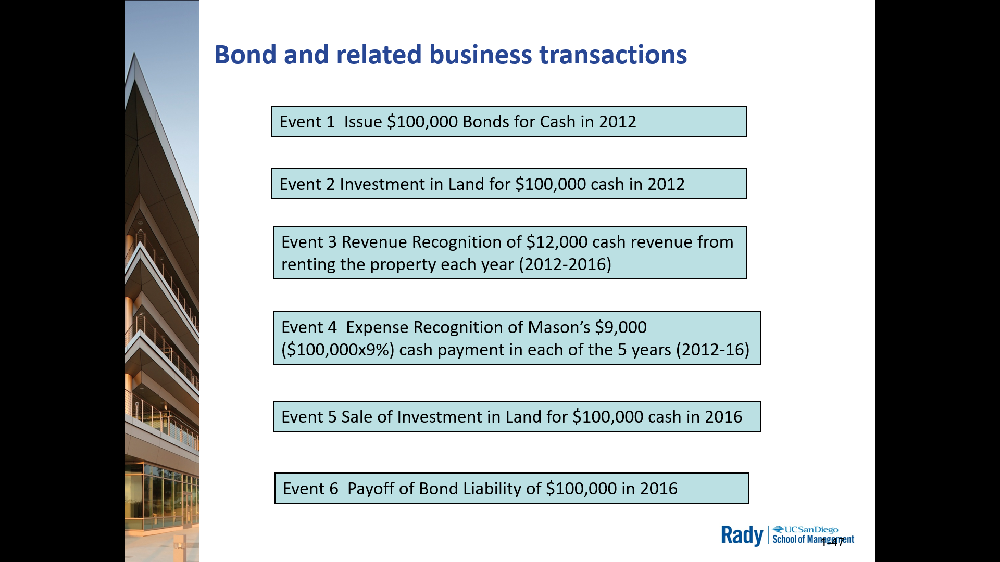

> Prof considers the bond interest a FA whereas book considers it an OA

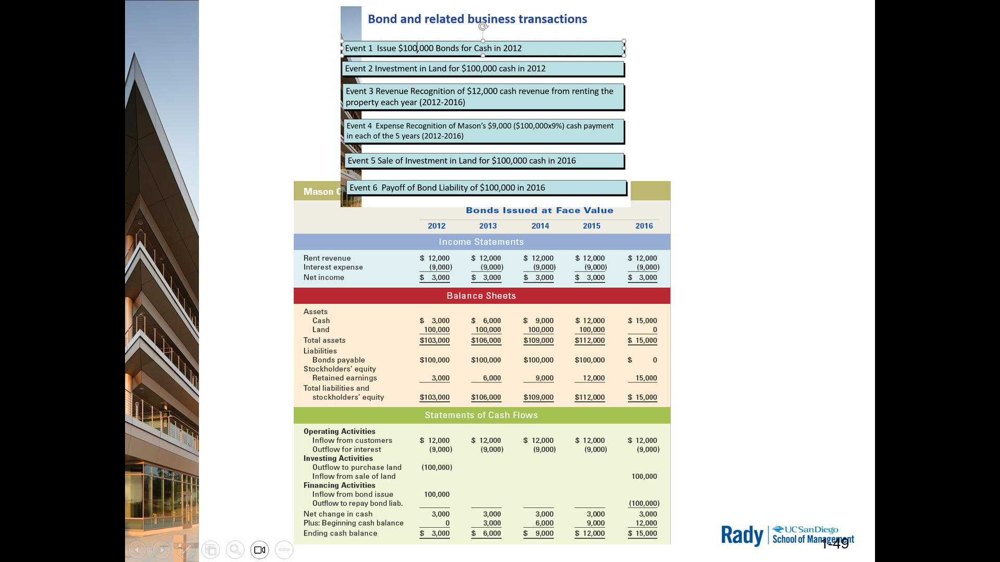

## 7. Distinguish between current and noncurrent liabilities and prepare a classified Balance Sheet