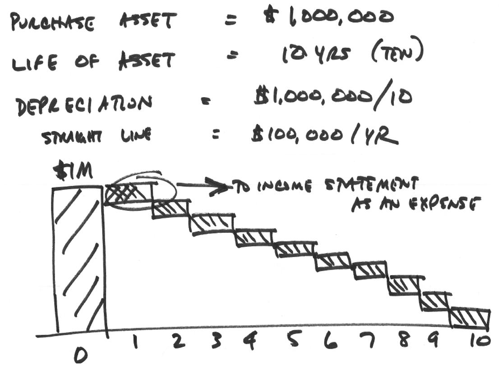
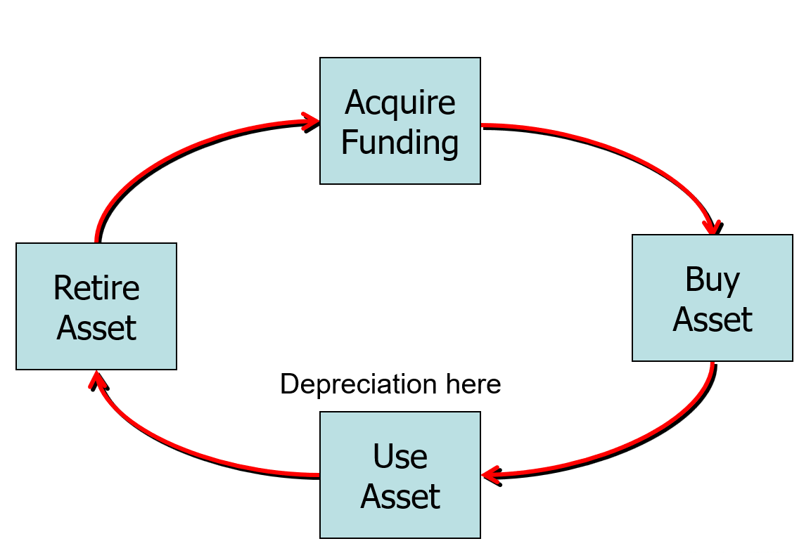
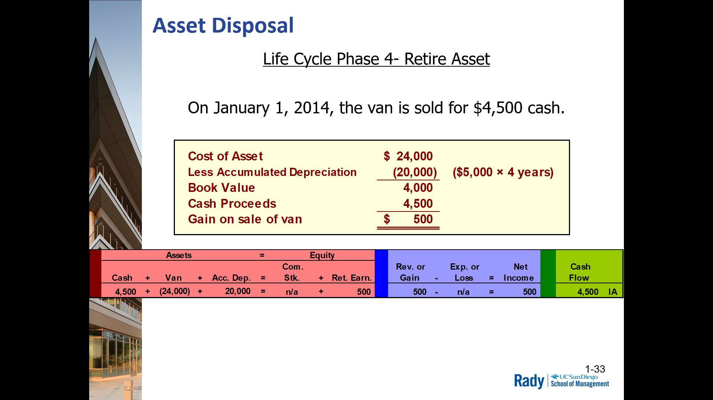
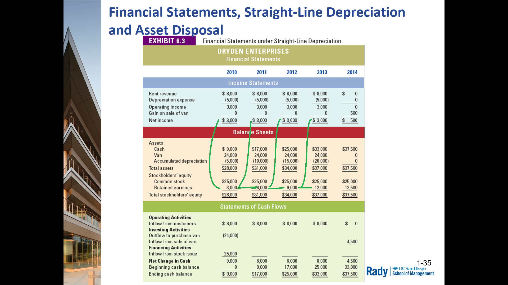
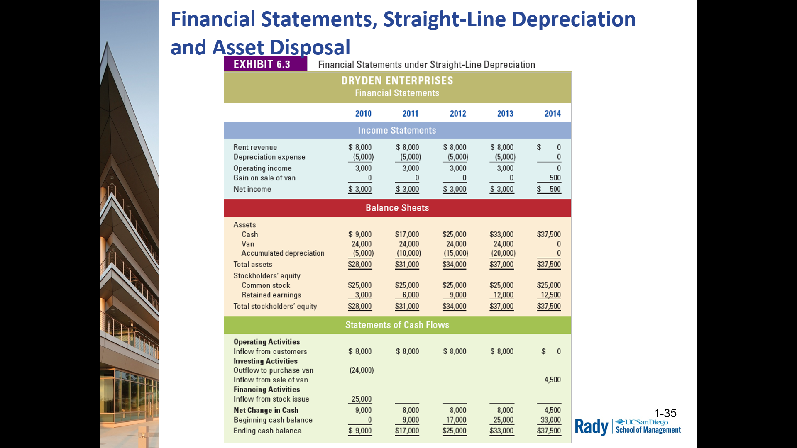
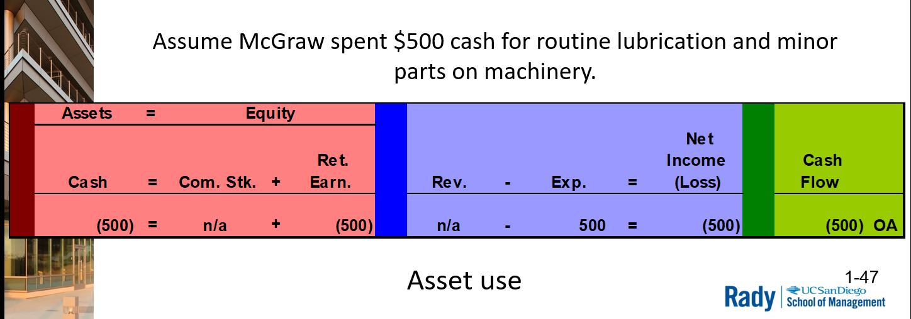
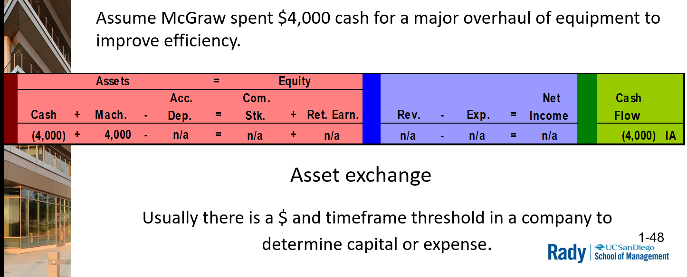

# Chp 6 - Accounting for Long-Term Operational Assets

As opposed to **current assets**, which turn into cash at the end of the accounting period

## 1. Identify different types of long-term operational assets and terminology

- Tangible
  - machines
  - buildings
  - vehicles
  - equipment

- Intangible
  - rights/privileges
  - patents
  - franchises

Both are long-term assets intended to last and provide value for multiple years

### Tangible Long-Term Assets

1. Property, Plant, and Equipment
   - AKA "fixed assets"
   - depreciate over their useful life
2. Natural Resources
   - mineral deposits, oil/gas reserves, etc.
   - depleted over their useful life
3. Land
   - Infinite life
   - Not subject to depreciation

### Depreciationn

- The amount of a tangible assets's cost that is transferred to expense on the income statement from the balance sheet during an accounting period.

- Done on a regular basis

- spreads cost of initial investment as expense to income statement over time 

- intends to match loss of profit generating ability over time

- Inc Expenses, Dec Profit, Generate tax benefit for company
  - Dec "book value" of asset on Balance Sheet

## 2. Determine the cost of long-term operational assets

- Cost of purchasing and commissioning assets

- Essentially BUYing and MAKING operational

### Land/Buildings

Involves purchase price as well as 
- sales taxes
- title search and transfer document costs
- Realtor's and attorney's fees
- cost of removal of old buildings
- remodeling costs
- etc.

#### Equipment

Includes purchase price (less discounts) as well as 
- Sales Tax
- Delivery
- Instalation
- Commissionning/Training

## Book value

- based on **Historical Cost**
- value on Balance Sheet at a point in time
  - value based on consistency not potential replacement value

## 3. Explain **depreciation** and hwo different depeciation methods affect financial statements

Non-Cash!

- **Straight-Line Method** - same amount of depreciation is taken each accounting period
  - (Asset Cost - Salvageable Value) / (Useful Life)
- **Double-declining Balance** - accelerated produces more deprecation expense in the early years of an asset's life, with declining amount of expense in later years
- **Units-of-Production** - (aka **business metric**) produces varying amount of depreciation in diff accounting periods depending upon the number of units produced

## 4. Determine how gains and losses on sales of long-term operational assets affect finanacial statements

- Book value: Asset Cost - Accumulated Depreciation

### Summary of Transaction

1. Acquire $25K from sale of common stock to purchase van, which will be in opertaion for 4 years
2. Purchase van for cash in January 1, 2010 for net cost of $24K.
   - Asset wil be in operation for 4 years
3. Use Asset: Generate first of four $8K annual cash revenue ammounts in this multi-year period
4. Use Asset: Depreciate asset (Asset Cost - Salvage Value) / Useful Life
5. Retire Asset: Sell van on January 1, 2014 for $4,500 cash

### Double Declining Balance Method

Depreciation Expense/year calculation is a 3-step process:
1. Determine straight-line RATE of depreciation
2. Multiply straight-line RATE times two
3. Multiply double-declining RATE by book value of asset at beginning of period
   - Book Value = Asset Cost - Accumulated Depreciation

## 5. Explain how continuing expenditures for operational assets affect financial statements.

**Expensed Costs:** Incurred to keep asset in good working order are expensed as incurred
- Routine maintainence
- Minor repairs 

> These $$$ are recorded directly to income statement

**Capitalized Costs:** Improve the quality of an asset & expected to last for more than 1 year.
- Capitalized as part of cost of asset
- Depreciation applies to it later

> These $$$ are recorded directly to Balance Sheet

## 6. Explain common intangible assets

- patents
- copyrights
- renewable franchises & trademarks
- goodwill

We **amortize**/spread cost of each over it's useful life

### Trademakes
- Name/symbol that IDs company/product. Coca-Cola logo
- Cost of trademark may include design, purchase, or defense of trademark

### Patents
- Exclusive legal right to produce and sell a product that has one or more unique features
- Cost of patent may include design, purchase, or defense of the patent
- Legal life of a patent is 20 years
  - Well for biotech, manufacturing alone takes 10 years. It's a long term investment

### Copyrights
- Protection of writings, musical composition, work of art, or other intellectual property
- Extends for life of creator plus 70 years

### Franchises
- Exclusive legal right to sell product/perform services in certain geographic areas

### Amortization

Gradual, normally even, reduction of an amoutn over time. Spreading the cost, just like depreciation

- Ex: amoritzed expenses on limited life intangible assets
- Evenly sproud cost to amt on income statement
- Similar to depreciation
- Non-cash

### Soft/intangible asset
- additional cost of assets could be expensed if it can be SHOWN there is impairment in value/change in expected value
- Has to be analyzed regularly
- Accounting/Business Judgement involved

### Impairment

Expected and estimated permanent decline in the value of an asset based on it's money making ability

- Happens when recovery of asset's cost/book value is not a realstic expectation
- expense to the income statement 
- reduce value of asset on Balance Sheet (reduction in utility)
  - lowers profit in an accelerated fashion

> EX: HP's acquisition of Autonomy for ~$11B and wrote off ~$9B shortly after

### Goodwill

- Excess cost over book value of assets on balance sheet acquired in a business acquisition
- Reflects reputation, management, market position
- Can be a very big portion of company's balance sheet if company is acquisitive
  - Pfizer
  - Microsoft
- Think of the diff in Apple's Balance sheet value vs their Stock Market Value
  - ~$350 Billion Balance Sheet vs ~$2T Stock Market Value

> You will buy companies for more than their Balance Sheet value - barring disaster