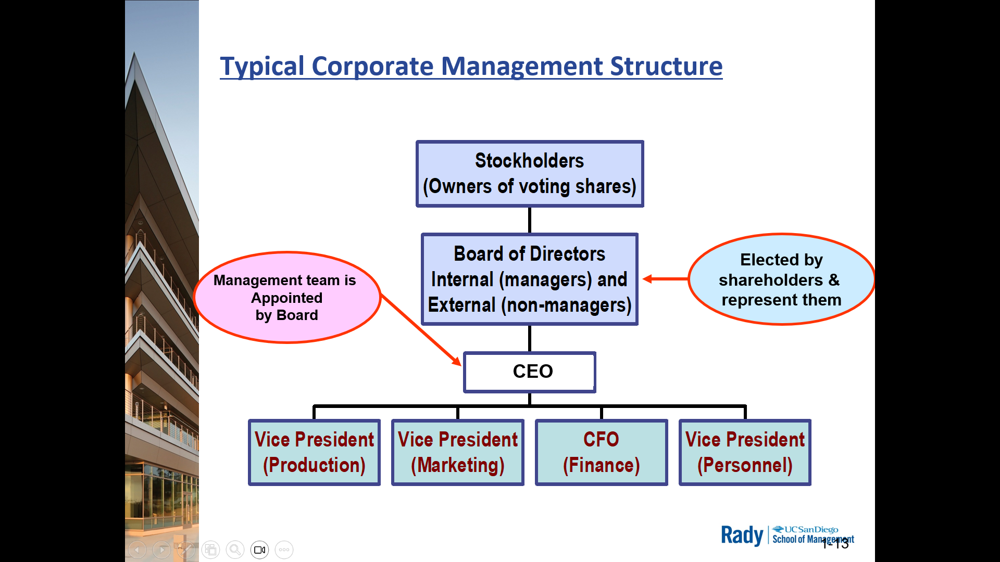
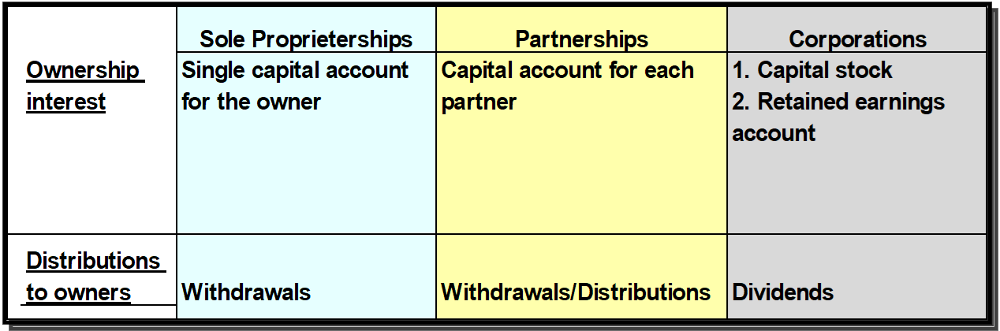

# Chp 8 - 

> Stock is the currency of ownership

## 1. Identify priary characteristics of sole proprietorship, partnerships, and corporations - different ownership structures

- **Sole Proprietorship**: owned by a single individual

- **Partnership**: owned by 2+ individuals
  - require clear agreements about
    - authority
    - risks
    - sharing of profits/losses

  > prudent partners minimize misunderstandings by hiring attorneys to prepare a partnership agreement defining 
  > - responsibilities of each partner 
  > - describing income/loss/capital division

- **Corporation**: separate legal entity created by the authority of a state government
  - state by state laws coverning & establishing corporations
  - All states require initial applications provide **articles of incorporation** (basic info):
    - Name
    - proposed date of incorporation
    - purpose
    - location
    - expected life (could be perpetuity)
    - provisions for capital stock
    - name+address of members of first board of directors
  - State establishes legal existence of corporatio by issuing a **charter of incorporation**
  
  > Both charter and articles can be foudn on Secretary of State's website

### Delaware - State for Business

60%+ of Fortune500 have chosen this state 

2 major reasons for dominance of corporate incorporation business
- Focus
- Courts

Express lane in 
- establishing and 
- maintaining corporations 
- working out disputes quickly

Examples
- Apple
- Gogole
- Facebook
- Wells Fargo
- Many of profs biotech corps

### Regaulations

Fewer laws govern operations of proprietorship and partnerships

Corps are subject to a LOT of regulations

Large, publicy traded US corps are MUCH MORE heavily regulated than smaller closely held corps

- SEC Acts of 1933 and 1934
- Sarbanes-Oxley Act of 2002
- Exchange listing res
- Ownership intersts are through stocks --> shared ownership
- Access to Public Capital Markets has **obligations**

### Advantages and Disadvantages of Corporations

Advantages
- Separate legal entity
- limited liability of stockholders
- Continuous life
- Easily transferable ownership rights (stock ownership)
- Ability to raise capital - access to a public pool of investors in the financial markets
- Professional Management Structure

Disadvantages
- Governmental Regulation & Reporting - and Associated cost
    > ~3M a year for accounting department alone
- Corporate double taxation
    > Net income is AFTER tax
    > Share holders get paid dividends (get's taxed again)

> Warren Buffet + Charlie Munger have a meeting in Nebraska basketball court
>
> thosuands of people go --> "It's like woodstock for investing"

## 2. Analyse ownership portion of financial statements for the diff types of ownership structures

Ownership interest (stockholder equity) in a business is comprised of
1. Capital stock or owner/investor contributions
2. Retained earnings or accumulated profits

## 3. Explain characteristics of major types of stock issued by corporations. Stock is the currency of ownership

**Stock**: ownership of a corp represented by shares that are a claim on the corps earnings and assets. A share or portion of ownership. Proportion of ownership is determined by # shares owned.
   - Essence of capitalism

**Classes of stock** - Common and Preferred
   - **Common**: usually entitles in matters taken up at shareholder meetings or by proxy
     - buy/sell stock
     - share in distribution of profits from dividends
     - share in distribution of assets in the case of liquidation meaning if the company goes out of business
     - Vote on sigificant matters that affect corporate charter
     - participate in election of board of directors
   - **Preferred**: gen not voting rights but higher prio on 
     - dividend distributions
     - distribution of asserts in case of liquidation (going out of business)
     > claims on assets/earnings whereby dividends must be paid on preferred stock before any can be paid on common stock

75% companies without preferred stock

> many times preferred stock has a richer and more consistent dividend. Like a hybrid between share of stock + bond

NOTE: A corporation can authorize additional classes of stock, each with its own set of contractual rights

**Outstanding shares**: portions of onership owned by stockholders. Shares of stock IN MARKET

**Market price/Price per Share (PPS)**: price of each share of stock int eh open market
   - changes every business day. 

**Initial Public Offering (IPO)**: first sale of corporation's stock to the public

**Secondary Offering**: subsequent sales of stock to public

**Market Value or Market Cap(italization)**: number of shares multiplied by market price. (PPS * num_outstanding_shares)

Categories of shares:
- **Authorzed Shares**: max num of shares of capital stock that can be sold to the public
  - **Issued & Outstanding Shares**: sold auth shares
  - **Unissued**: not-outstanding auth shares

## 4. Explain treasury stock

**Treasy Stock**: Issued stock that have been reacquired by the corporation

No voting/dividend rights

Reasons to buy back their own stock?
- Funding Employee stock option plans
- Increase earnings per share (EPS)
  - Net Income / # Shares
- Supporting the stock price
- Avoid hostile takeover

## 5. Explain the effects of declaring and paying cash dividends on a company's financial statements

- Not required to pay dividends
- Declaring dividend --> legal obligation
- Investors can benefit by growth & income
- Companies that have increased annual dividend every year for at least 25
- A show of financial strength

3 Important Dates
- Declaration Date: Transaction needed
  - record liability for dividend
- Date of Record: No transaction required.
- Payment Date: Transaction Needed
  - Record payment of cash to stockholders

## 6. Explain the effects of stock splits on a company's financial statements

- Same market cap, but lower market price makes ownership more affordable
- Arguably cosmetic but also psychological
- Replace existing shares with greater number new shares
  - any ratio to 1
  - commonly 2:1
  - can also have reverse splits

- Normally use stock splits to reduce market price per share of outstanding stock (Amazon 20:1)

- num outstanding shares ++ | proportionate | price per share -- 

- retained earnings not affected

- usually welcomed by market (sign of strength)