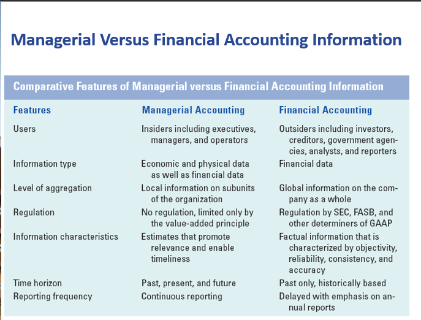
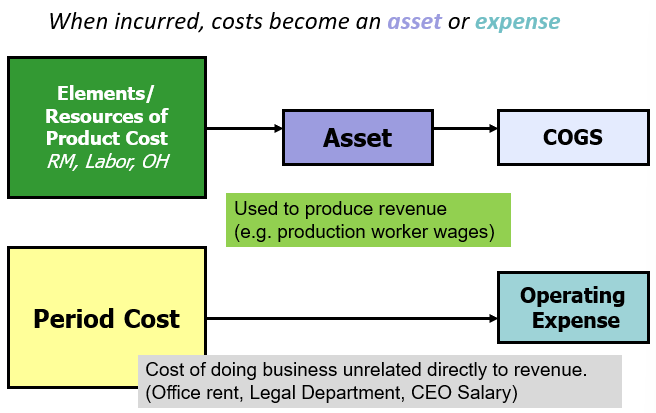

# Chp 10 - Intro to Managerial Accounting

All about costs and what you can control inside the company

Learning Objectives:

1. Distinguish b/w Managerial and Financial accounting

2. Identify the cost components of a product made by a manufacturing commpany: the cost of materials, labor, and overhead

3. Explain the impact on financial statements of product costs versus selling, general and administrative costs

4. Prepare a scehdule of costs of goods manufactured and costs of good sold

5. Distinguish product costs from upstream and downstream costs relative to manufacturing costs

6. Explain how product costing differs in service, merchandisin and manufacturing companies

## Managerial vs Financial Accounting

Managerial:
- internally focused
- relate to future/present/past
- not regulated externally
- optimizing limited resources
- help run the company
  > think of campus orgs

Financial:
- externally focused
- mainly for investors
- based on historical information
- extensively regulated
- generally consistent for companies within a given industry

### Managerial
- AKA Cost Accounting
  > You can only **influence** sales but can **control** costs
- Branch of accounting
- Focused on **costs** of [making/buying] product/service [sold/delivered] to [customers/clients]
- Internal mgmt reporting
- designed to assist those who run the company
  - for **decision makers** within company walls
- Manufactoring companies **more complex** managerial
  - many products
  - especially international company
  > Underlying idea: need for every business selling products to
  > - [protect/grow] [margin/profit]
  > - maintain quality of [product/services] at acceptable levels
- **Gross margin** pays for all other costs of running company & net income
  - engine of growth/value
  - know your CoG [produced/sold]!

## Product Costing/Pricing are related

Product Cost --> Managers need to know
- cost of products/services for many reasons
- pricing being one

Cost plus pricing --> common business practice

> Business should know its costs to price effectively

## Manufacturing costs

Synonyms
- Making
- Manufactoring
- Producting

The big 3 manufacturing resources
1. Raw Materials
2. Labor
3. Overhead

**Product Costs**
- Capitalized first
- $$$ flow through balance sheet
- transferred to CoGS when there is a matching sale

**Operating Expenses/Period Costs**
- Expensed
- $$$ recorded directly to Income Statement as OpEx

> Not a $f(product)$

> One could say that manufacturing is a subset of merchandising.
>
> In the sense that it has the same flow but is more complex