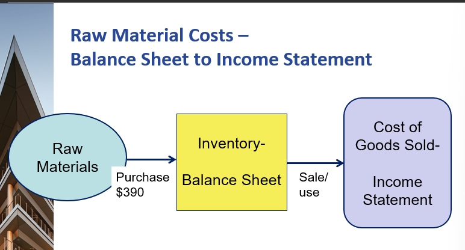

# Chp 10 - Intro to Managerial Accounting

All about costs and what you can control inside the company

Learning Objectives:

1. Distinguish b/w Managerial and Financial accounting

2. Identify the cost components of a product made by a manufacturing commpany: the cost of materials, labor, and overhead

3. Explain the impact on financial statements of product costs versus selling, general and administrative costs

4. Prepare a scehdule of costs of goods manufactured and costs of good sold

5. Distinguish product costs from upstream and downstream costs relative to manufacturing costs

6. Explain how product costing differs in service, merchandisin and manufacturing companies

## Managerial vs Financial Accounting

Managerial:
- internally focused
- relate to future/present/past
- not regulated externally
- optimizing limited resources
- help run the company
  > think of campus orgs

Financial:
- externally focused
- mainly for investors
- based on historical information
- extensively regulated
- generally consistent for companies within a given industry

### Managerial
- AKA Cost Accounting
  > You can only **influence** sales but can **control** costs
- Branch of accounting
- Focused on **costs** of [making/buying] product/service [sold/delivered] to [customers/clients]
- Internal mgmt reporting
- designed to assist those who run the company
  - for **decision makers** within company walls
- Manufactoring companies **more complex** managerial
  - many products
  - especially international company
  > Underlying idea: need for every business selling products to
  > - [protect/grow] [margin/profit]
  > - maintain quality of [product/services] at acceptable levels
- **Gross margin** pays for all other costs of running company & net income
  - engine of growth/value
  - know your CoG [produced/sold]!

## Product Costing/Pricing are related

Product Cost --> Managers need to know
- cost of products/services for many reasons
- pricing being one

Cost plus pricing --> common business practice

> Business should know its costs to price effectively

## Manufacturing costs

Synonyms
- Making
- Manufactoring
- Producting

The big 3 manufacturing resources
1. Raw Materials
2. Labor
3. Overhead

**Product Costs**
- Capitalized first
- $$$ flow through balance sheet
- transferred to CoGS when there is a matching sale

**Operating Expenses/Period Costs**
- Expensed
- $$$ recorded directly to Income Statement as OpEx

> Not a $f(product)$

> One could say that manufacturing is a subset of merchandising.
>
> In the sense that it has the same flow but is more complex

## Big 3 Manufactoring costs

> And their influence on financial statements (product costs vs selling, general, & administrative costs)

1. Direct Materials
   - Basic resource/parts
   - e.g. eggs, flour, water, cocoa beans for choco
   
2. Direct Labor
   - cost of wages to workers w/ direct contact w/ product + can be traced to product
   - e.g. factory operators for choco

3. Overhead
   - Cannot be traced to specific products
   - AKA indirect costs
   - Depreciation, rent, taxes, supervisory salaries, etc.
   - machines/facilities for choco

Notes
- production costs flow through balance sheet
- period expense do NOT flow through balance sheet
  - selling + administrative salaries
  - depreciation
- Inventory (big 3 goes to BS as this first)
  - $$$ collected as product is ade
  - stay in BS until product sold
  - $$$ released as CoGS at product sale

### Case Example: Patillo Manufacturing Company

**Event 1**: Acq $15K from issuing common stock
- cash = ComStk
- FA

**Event 2**: Pay $2K for materials to be used for products
- direct materials
- (Cash) + Inventory = 0
- OA

**Event 3**: Pay $1.2K for salaries of selling/admin emp
- overhead
- (Cash) = (Ret Earn)
- Expense: indirect/overhead
- OA

**Event 4**: Pay $3K for wages of prod workers
- (Cash) + Inventory = 0
- OA

**Event 5**: Pay $2.8K for furniture used in selling/admin offices
- (Cash) + Office Furn
- IA

**Event 6**: Recog depreciation on furniture. 
- Dep deets
  - Acq Jan 1
  - $400 est salvage val
  - 4 year useful life
  - $600 annual dep charge
- (Off Furn) = (Ret Earn)

**Event 7**: Paid $4.5K for manufacturing equipment
- (Cash) + Manuf Equip = 0
- IA

**Event 8**: Recog depreciation on equipment.
- Dep deets
  - Acq Jan 1
  - $1.5K est salvage val
  - 3 year useful life
  - $1K anual dep charge
> Note: Balance sheet didn't have enough columns. Should belong on Accum. Dep. but lumped into Inventory instead
- Inventory + (Manuf Equip) = 0

**Event 9**: Sold inventory to customers for $7.5K 
- Cash = Ret Earn
- Revenue: selling inventory is manuf bus model
- OA

**Event 10**: Recog $4K in CoGS for sold inventory
- (Inventory) = (Ret Earn)
- Expense: match the revenue to cost of production
  - take from inventory since that's where everything was built up

### Overhead/Indirect Costs

- Depreciation
  - type 1: production cost (flow through BS)
  - type 2: period expense (does NOT flow through BS)
- Supervisor's Salary
- Utilities
  - shared costs usually pooled
  - allocated to many in multi-product env
  - diff to pinpoint specific usage b/w prod

> What if split 50/50? You'd overprice chairs, underprice tables.
>
> Disproportionately sold products
>
> Could potentially drive yourself out of business.

## Recap

1. Materials
2. Labor Overhead

Matching principle
- Prod costs start on BS (inventory)
- Released as CoGS to IS on product sale

Depreciation 
- Overhead
- Manufacturing related : starts on balance sheet
- period expense : does not start on balance sheet

## Schedules for CoG Manufactured/Sold

**3 distinct inventory accounts** reflect steps in production process. What's leftover in each is reported on BS
1. Raw Materials
2. Work-In-Progress
   - not saleable
   - transfered to Finished Goods acc: **cost of goods manufactured**
3. Finished Goods
   - ready for sale
   - cost transferred to **cost of goods sold** on income statement 
   - matched up with sale

- Examine each inventory to understand flow of materials & conv res (labor + overhead) expended in production process
- RM --> WIP --> FG --> COGS
  - WIP --> FG: CoG Man.
  - FG --> CoGS: goes to IS and matched against associated revenue
    - Inventory --> IS transfer 
  
  - Beg Inv + Trans In = Trans out + End Inv

## Upstream and Downstream Costs

When do costs occur relative to manufacturing process?

Upstream Costs: BEFORE
- usually R&D

Downstream Costs: AFTER

## Differences in product costing (service vs merch vs manuf)

Service: No Inventory
- Period costs
- Operating Expenses

Merchandising: No Conversion
- Period costs
- Operating Expenses

Manufacturing: Most complicated
- Labor and Overhead
- Product Cost/CoGS

## Review Questions

1. What are the 3 main costs for a manufacturing company?
2. In manufacturing and merchandising companys, when do costs start on BS and get released to IS? Name the type of cost and give subtypes
3. What are the 3 types of inventory accoutns for a manufacutring company? What's the flow?
4. What is the Inventory Formula?
5. What are the 2 types of Depreication? What are the subtypes of Overhead? Describe their flow through BS/IS