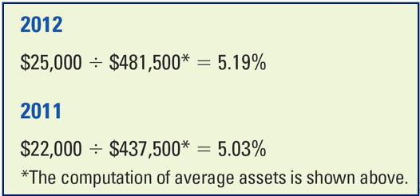

# Chp 9 - Financial Statement Analysis

Key Analytical Skill!

Investment world uses this a lot!

1. Differentiate b/w Horizontal and Vertical analysis
2. Explain ratio analysis
3. Calculate ratio for assessing a company's liquidity
4. Calculate ratio for assessing a company's solvency
5. Calculate ratio for assessing a company management's effectiveness
6. Calculate ratio for assessing a company's position in the stock market
7. Review key ratios
8. Explain the limitations of financial statement analysis

## 1. Differentiate b/w Horizontal and Vertical analysis

**Horiontal** (trend) analysis: studying the behavior of individual financial statement items over several accountig periods
- Absolute Analysis
- Percentage Analysis

**Vertical** analysis: percentages to compare individualcomponents of financial statements to a **key statement figure**
- compares within a single period
- common-size financial statement: financial statements items are expressed as a percentage of a given measure
  - Income Statement: percentage of sales
  - Balance Sheet: percentage of total assets

**Closing Thoughts**: Expressing analyses in percentages really help 
- management understand the results
- hone in on problems
- enhance performance

Concept of management by exception applies here

## 2. Explain ratio analysis

Studying various relationships b/w diff items reported in a set of financial statements

Allows us to analyze the financials of one company
- for diff time periods 
- compare against other companies/industries

## 3. Calculate ratio for assessing a company's liquidity

Measures(noun) and ratios indicate co ability to pay short-term debts.

Can they cover their curr obligations?

Focus on current assets/liabilities

### Working Capital

Current Assets - Current Liabilities 
- excess resources company will have available for operations (at a point in time)
- "cushion" against short-term debt-paying challenges

### Current Ratio

Current Assets / Current Liabilities
- short term debt/obligation paying ability
- For every dollar of short term debt/obligation, what is the level of short term asset coverage?
- Declining ratio 
  - may be sign of deteriorating financial condition
  - might result from eliminating obsolete inventories

### Quick Ratio (Acid-Test)

Quick Assets / Current Liabilities

Quick Assets
- Cash
- Current Marketable Securities
- Accounts Receivables

> Essentially excludes Inventory

Measures company's ability to meet obligation without having to liquidate/sell inventory

What is your coverage if you rely on cash on hand and potential collections?

### Accounts Receivable Ratios

Accounts Receivable **Turnover** Net Credit Sales / Average Accounts Receivabl

- Measure of collection efficiency

- How many times a company converts (collects) it's receivables into cash each year (on average)

Average **Days to Collect Receivables** (aka **Days Sales Outstanding (DSO)**)

Average **Collection Period** = 365 Days / Acounts Receivable **Turnover**

- How many days it takes to collect the average amt of accounts receivable based on a year
  - Theoretically, collects accounts receivables every X days

### Inventory Ratio

Inventory **Turnover** = Cost of Goods Sold / Average Inventory

- How many times a company's average inventory has been sold and replaced during the year

Average **Days to Sell Inventory**

Average **Sales Period** = 365 Days / Inventory **Turnover**

- How many days it takes to sell the invetory (on average)
  - Theoretically, inventory sold and replenished every X days

## 4. Calculate ratio for assessing a company's solvency

Used to analyze LONG TERM 
- debt/obligation-paying ability
- capital structure

### Debt to Assets Ratio

**Debt to Assets Ratio** = Total Liabilities / Total Assets

- Percantage of company assets financed by debt

### Debt to Equity Ratio

**Debt to Equity Ratio** = Total Liabilities / Stockholders' Equity

- Compares creditor funding to owner funding

**Stockholders**: like a lot of debt if the company can take advantage of positive financial leverage. Less dilution (hold)

**Creditors**: prefer less debt and more equity because equity represents a buffer of protection.

### Number of Times Interest Earned

**Times Interest EArned** = Earnings before Interest Exp and Income Taxes / Interest Expense

- Essentially Operating Expense / Interest Expeense
- Most common measure of company's ability to provide **protection for it's lon-term creditors**. 
  - Think of it as a buffer
- Dollars of operating income PER dollar of interest payable

## 5. Calculate ratio for assessing a company management's effectiveness

Measurements of company and management ability to 
- generate sales/earnings
- ultimately create more value for shareholders

### Net Margin (or Return on Sales)

**Net Margin** = Net Income / Net Sales

Percent remaining of each sales dollar after subtracting all expenses
- cost of coogs sold
- operating expenses
- taxes
- other expenses

o

### Asset Turnover Ratio

**Asset Turnover** = Net Sales / Average Total Assets

Sales dollars generated for each dollar of assets invested

### Return on Investment (ROI)

**ROI** = Net Income / Average Total Assets

Net Income to Amoutn Invested

### Return on Equity (ROE)

**Return on Equity** = Net Income / Avg Total Stockholders' Equity

Used to measure profitability of stockholders' investment

-- Apple bought back stocks (treasury)

## 6. Calculate ratio for assessing a company's position in the stock market

Stock market analyze the earnings and dividends of a company

### Earnings Per Share

**Earnings Per Share** = Net Earnings Available for Common Stock / Average Number of Outstanding Common Shares

simply put... Net Income / Oustanding Shares

### Price-Earnings Ratio

**Price-Earnings Ratio** = Market Price per Share / Earnings per Share

- compares market price for a share of company to their earnings
- how much will investors be willing to pay for a $hare of earnings?
- Sometimes can be an indicator of whether stock is exp/cheap within industry

### Dividend Yield

**Dividend Yield** = Dividends per Share / Market Price per Share

- identifies the return (cash dividends) on current market price of stock
- How much dividend will I receive per dollar of share price?

## 7. Review key ratios

Liquidity

1. Working Capital
2. Current Ratio
3. Quick Ratio
4. Accounts Receivable Ratios
5. Inventory Ratios

Solvency

6. Debt to Assets Ratio
7. Debt to Equity Ratio
8. Number of Times Interest Earned

Profitability/Management Effectiveness

9. Net Margin (or Return on Sales)
10. Asset Turnover Raio
11. Return on Investment
12. Return on Equity

Stock Market

13. Earnings Per Share
14. Price-Earnings (P/E) Ratio
15. Dividend Yield

## 8. Explain the limitations of financial statement analysis

- Different Industries
- Changing Economic Environment
- Accounting Principles

Need to understand the business!