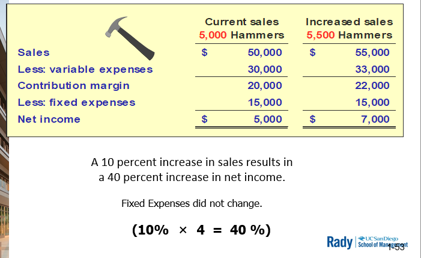

# Chp 11

**Cost-Volume-Profit Analysis**
- CVP 
- understand profit drivers in merch/manuf co.
  - relationship of costs, volumes, revenues
- analyze
  - price
  - cost
  - profit **per unit**
- Understand cost behaviour + categorizing costs
  - variable
  - fixed
- Very valuable analystial tools
  - ability to **understand and preditct** behaviour of the engine of profit
- Getting to the core of profit generation in a business
- Questions
  - If we reaise price?
  - If we lower costs?
  - If we sell more units?

Operating Leverage & Breakeven

## Fixed Cost Behavior

Total fixed cost: constant
Fixed cost PER UNIT: inversely proportionate to activity

Cost type           | Activity Inc  | Activity Dec
---                 | ---           | ---
Total Fixed Cost    | Constant      | Constant
Fixed Cost per Unit | Decrease      | Increase

## Variable Cost Behavior

Total variable cost: proportionate to activity
variable cost PER UNIT: constant

Cost type           | Activity Inc  | Activity Dec
---                 | ---           | ---
Var. Cost per Unit  | Constant      | Constant
Total Var. Cost     | Increase      | Decrease

---

Overview

Cost type       | Total Cost    | Cost Per Unit
---             | ---           | ---
Fixed Cost      | Constant      | Inversely
Variable Costs  | Direct Propr  | Constant

### Mixed Costs

Also known as Semi-Variable
- mix of fixed and variable costs
- initial fixed + variable unit (e.g. time based) cost

Mixed = Fixed + Var x Units

Mixed = (Fixed/Units + Var) x Units

### Cost-Volume-Profit Analysis

Scenario
- $48K band
- $2/tix profit
- How to price tix to breakeven?

Thought Process
- Recall similar event: 3K attendees
  - account for 10% margin of error

Num tix sold:   | 2.7K  | 3.0K  | 3.3K
---             | ---   | ---   | ---
Tot cost o band | $48K  | $48K  | $48K
Cost per Tix    | $17.78| $16.00| $14.55

> Note: Cost per Tix is NOT Tix pricing. Does not provide profit as is

## Contribution Margin

= Revenue - Variable Costs

- separate costs into variable and fixed
- remaining amt will cover fixed costs and profit
- AKA variable profit from sales. 
  - What profit are you generating WITHOUT accouting for fixed costs?

\-                      | Total     | Unit
---                     | --:       | ---
Sales Revenue           | $100K     | $50
(Variable Costs)        | ($60K)    | ($30)
**Contribution Margin** | $40K      | $20
(Fixed Costs)           | ($30K)    | -
Net Income              | $10K      | -

> Contribution Margin is an internal measure, more managerial data - not disclosed to the public

### Contribution Margin Analysis

Contrib Margin vs Gross Margin formulas
  - Contrib Margin = Revenue - VarCosts
  - Gross Margin = Revenu - CoGS

Unit of Contribution?
 - Tot Contrib Margin/units
   - measure how much contribution each unit sold the co. brings in

Contrib Margin Ratio?
  - Total CM/Revenue or Unit CM/Unit Price
  - indicates how much contrib margin per revenue dollar the co. brings in

Volume change effect?
  - Contrib Margin: proportional to volume
  - Operating Income: equal to contrib margin diff

## Operating Leverage

- Relationship of (% change in sales) to (% chagne in operating income)
- high proportion of (fixed cost):(variable costs) ==> high operating leverage
- Result: high flow-through of incremental revenue to bottom line

Questions
- what happened to income when sales changed by +/- 10%
  - $\Delta$Income = 17%

> Change in sales resulted in a disproportionate amount incr/dec income

### Case Example

Recall concert planning scenario

> "As Leverage giveth, Leverage taketh away"

Leverage can be SHARP, you can hone it's edge by ramping up fixed costs

## Risk & Reward Assessment

Balance fixed/variable cost structure
- Risk: prob that costs may exceed benefits
- Reduce risk: convert fixed costs --> variable costs
  - Protect downside
  - Limits upside

### 100% Variable Cost Structure

Num tix sold:   | 2.7K  | 3.0K  | 3.3K
---             | ---   | ---   | ---
Cost per Tix    | $16   | $16   | $16
Tot cost o band | $43.2K| $48K  | $52.8K

## Magnitude of Operating Leverage

Contribution Margin / Net Income

- Can one derive this measure from Financial Statements?

## Break-Even Point

- Level of sales where there is no profit/loss
- Sales level achieved that exactly covers ALL costs (fixed + variable)
  - Revenue - All Costs = Profit = 0
- Can be calculated using 
  - the equation method: derived from income statement
  - contribution margin per unit method
- **Sales Volume** Can be expressed in terms of
  - $ sales to breakeven
  - unit to sell to breakeven

Case Example
- Cost-plus-pricing strategy
  - price = cost + 50% markup
    > markup is NOT gross margin
- $24 manufacturing Cost
- $36 unit price
- $60K fixed cost

Equation method:

Contrib Margin/Unit method:
- Unit price - Manuf Cost = Contrib Margin/Unit

## Sales Volume to Achieve

Calculate sales volume required to attain a target profit

Equtaion method:

Contrib Margin/Unit method:

## Margin of Safety

Cushion between X sales and break-even point
  - budgeted
  - estimated
  - planned
  - targetted

Quanitifies the amount by which actual sales can fall short of expectation before company **incurs losses**

Can be expressed in
- units
- $
- %

## Summary

