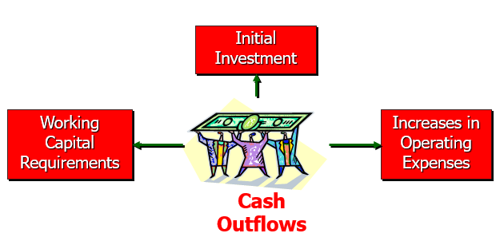
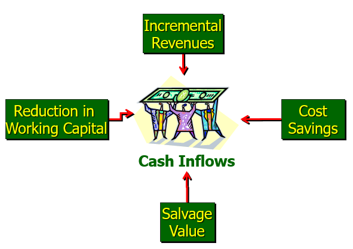
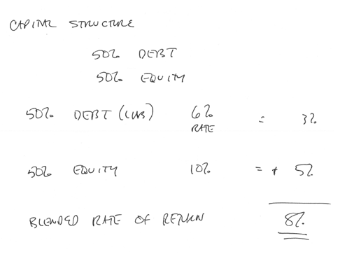
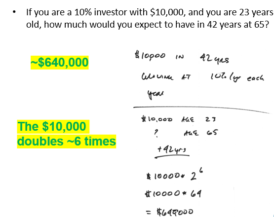
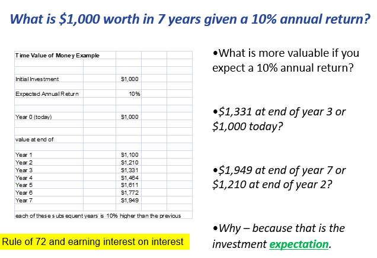
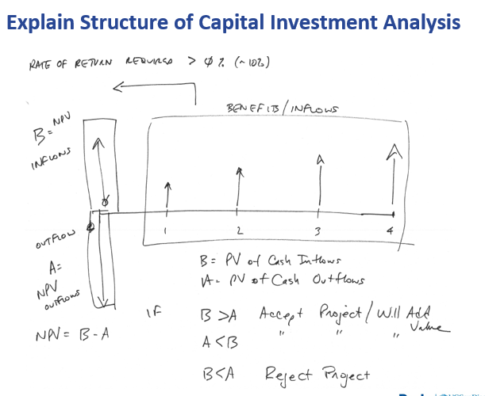
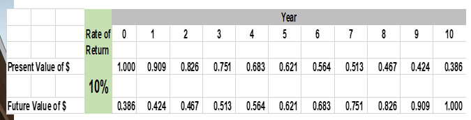
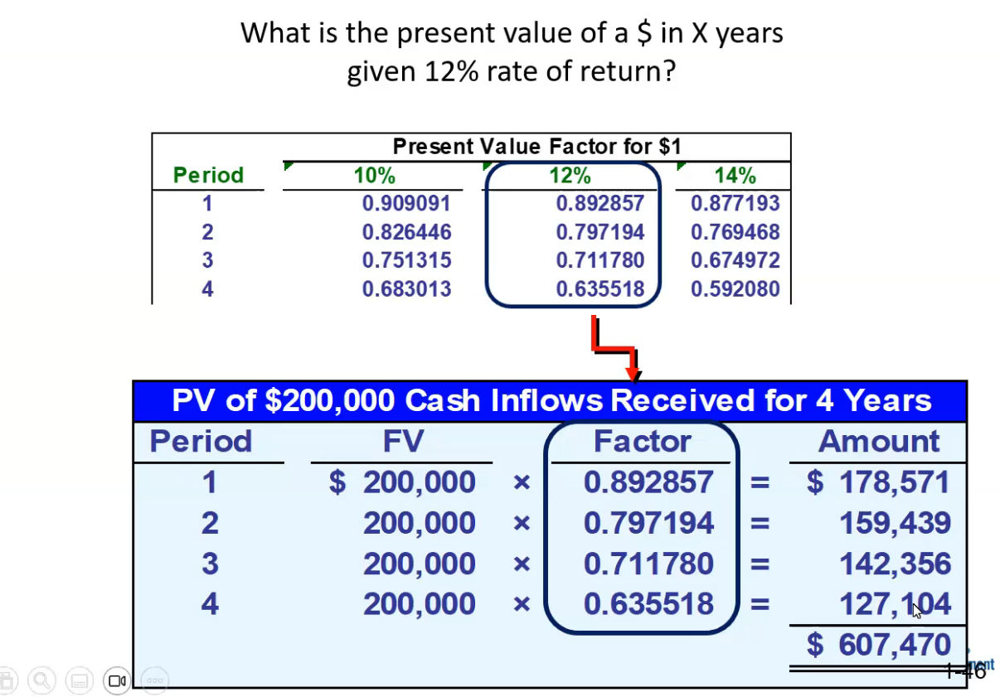

# Chp 16 - Capital Investment Analysis & Time-Value of Money

Evaluating Capital (aka Long Term Asset) Investment Decisions

Goal: be equipped to evaluate and compare diff big $ investments

- Very impo. and great skill to have in business
- Also helpful in your personal life
  - applies to business investments
  - applies to buying home, fundign retirement, funding college education
- Will also learn fancy finanial math

Learning Objectives
1. ID cash flows associated w/ investment opp.
2. Explain investor returns and apply it to capital investment decisions
3. Explain time-value of money and determine the present value of future cash flows
4. Determine and interpret the net present value of an investment opp.
5. Compare capital investment alternatives
6. Determine and interpret the internal rate of return of an investment opp.
7. Determine the payback period for an investment opp.
8. Conduct a post audit of a completed investmenet

## Capital Investment Decision Basics

Capital Investment: purchase of long-term Operational Assets
- Long Term Assets
- Fixed Assets

Intended to provide value for more than one year

Usually cost beyond certain threshold of $ in company

Purchase = long-term commitement 

Limited capital to use, should be used wisely

## Measureing Investment Cash Flows

**Outflows**

**Inflows**

> Everthing is denominated in cash,,, cash is king

### Minimum Rate of Return/Cost of Capital

Notion of ***Expected*** Returns to Investors
- Investors: fund business (Equity holders + creditors)
- Require return, should meet or beat expectations

> Want their money to grow exponentially

- want a return ON the investment (ROI), not to mention return OF invemtment 

#### Example

Invest $1M, expect additional $100K and repaid the $1M in 1 year
- expected annual ROI: 10%(100K)
- end of year expectation: $1.1M return
- company presumably makes more than the \$100K paid to investor for borrowing their $1M
- what happens whan return expectation is not met?

Capital structure determines (cost of capital/minimal rate of return)
- blend of equity & debt or stockholder equity & liabilities
gives implied ecpected rate of return for company to return to investors
how much does company return/pay back to investor?

Blend of creditors/debt and owners/equity cost ==> cost of capital for an organization  

**Cost of Capital** = how much money worth // how much an investment dollar is worth to company
- reality: company is collection of projects intended to enrich shareholders
- most companies: oners or equity/stockholders expect increased stock values and dividends
- creditors expect: interest payments + principal

**Cost of Capital**: return that company expects to deliver to claim holders

### Example

Assuming 6% debt, 10% equity evenly split

### Weighted Average Cost of Capital (WACC)

Blend from diff sources of capital or from diff investors

== How are company assets funded and at what cost?

### Expected Retrns to Investors

Businesses normally have a rate of return needed to approvie capital projet
- Minimum Rate of return required
- usually == weighted average cost of capital
- AKA hurdle rate // discount rate // cost of money or cost of capital

What factor will make components of debt & equity --> ultimately WACC higher/lower?
- RISK!

#### Variability

**Debt**: lower/higher depends on 
- company's earnings 
- cash flow history 
- ability to pay lenders

**Equity**: lower/higher depends on
- historical earnings performance
- company's earnings prospects
- industry
- market position
- management

- Inc Risk == Inc higher expected return

**Capital Structure**: could vary based on above
- some companies can't even obtain debt

What is "normal" for established companies?
- Debt: mid singles - low double digits (esp now in interest rate env)
- Equity returns for S&P 500 since 1920's have averaged ~10% compounded annual growth rate including dividends

Established companies normally somwhere in high single - low double digits

## Time Value of Money

$1,000 now vs $100/qtr for next 10 qtrs?
- inflation and returns erode value of future $
- expected returns generally reode future $ more *drastically* than inflation
- need more money tomorrow to equal value of today's money. ESP as an investor

> Capital investment analysis denominates future $ into present $ since one is looking multuiple years into the future. Need a way to standardize cash flows

### How does money grow exponentially?

> Rule of 72 ==> 72/(rate of return * 100) ~= years for money to double

Ex: \$1K for 7 years @ 10% annual return

$1K * (1.1)^7 ~= $2K

So, if you are a 10% investor, your \$1K today needs to grow to $2,000 in 7 years

### Net Present Value of a property

- Money can grow exponentially
- Investors expect exponential return on money

- net present value needs to be calulcated to compare future to present -- to measure if project delivers acceptable return on investment 

- net **present** value of future inflows VS net **present** value of current + future outflows
  - Inflow > outflow ==> project adds value

### Convert between Present Value and Future Value

#### Compounding 

(Future Val) = (Present Val) x (1 + Rate of Return)^n

n is the number of terms

#### Discounting

(Present Val) = (Future Val) / (1 + Rate of Return)^n

n is the number of terms

### Evaluating Capital Investments

- You will have to discount future cash flows when analyzing capital investment opps
- Present Value converstion of cash flows enables "apples to apples" comparison of investment alternatives

> Picture the cash flows: draw a pic to keep it clear in your mind

## Net Present Values (NPV)

Method of evaluating a multiyear investment (subject to time value of money impacted cash flows)

Subtract cost of investment (normally in the beginning) from present value of future cash inflows ==> dets the net present value of the investment opp

Positive net == investment will yield a rate of returen > required rate of return (add value)

Negative net == investment return < required rate of return (subtract value)

\$583K investment w/ 12% expected return. \$200/year revenue for 4 years, discounted present value future inflow of \$607K. 

Positive net present value of \$24K --> company SHOULD invest in the projectors