# Chp 12 - Cost Accumulation, Allocation & Assignment

About spreading costs to products or services in the most sensible and cost effective way 
- help management understand business
- improve decision making

Accurantly computing costs for each product/service requires
- spread and assigning costs *based on resource consumption* of that cost

> Follow the resource usages. Goal: assign costs as closely and reasonably as possible with resource useage

Managerial accounting lead companies in 
- accmulating, allocating and assigning costs 
- in a cost effective and relevant manner

1. ID cost objects and cost drivers
2. Distinguish direct costs from indirect costs
3. Allocate indirect costs --> cost objects by 
- selecting appropriate cost drivers and 
- following a calculation method
4. Explain the benefits and detriments of allocating pooled costs

## ID cost objects and cost drivers

## First Principles

Managers must have reliable cost estimates to
- price products
- evaluate performance
- control operations
- perpare financial statements

> Need to know costs to run your business most effectively

## Cost Objects

Commonly: product or service sold in company
- can be whatever is of interest to company
  - operations
  - factories
  - geographies
  - product lines

iPhone example:
- all iPhones (cost within a timeframe)
- certain iPhones (e.g. the newest model only)
- geographies (e.g. Europe vs Asia)

Airline example:
- domestic operations
- individual flights (e.g. SD --> Chicago on May 20th)
- certain routes

## Cost Driver

Influence resource consumption or cost behavior for a cost object

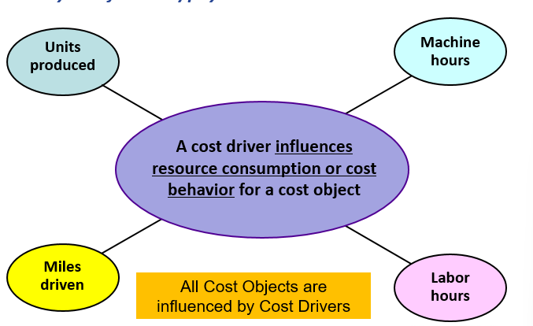

> All COs are influenced by CDs

## Objects & Drivers

Nesting is possible (primary & secondary objects & drivers)
- secondary is subset of primary

Example:
- Primary obj: cost of iPhone product line @ AAPL
- Primary driver: total iPhones produced
  - Secondary obj: cost of iPhone 11, SE, 12, 13

(Primary Total) <--driven by-- production of all of the diff iPhones (11, SE, 12, 13)

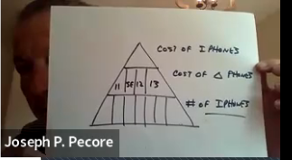

### Use of Cost Drivers to Accumulate Costs

Tuesday night ball game offering free baseball caps to children

Primary costs obj: cost of promotion
- what drives the cost of the promotion?
- determine cost and drivers of secondary cost obj

Secondary cost obj: Cap, Advertisement and Labor Costs
- cost driver: number caps
- cost driver: number ads
- cost driver: number labor hours worked

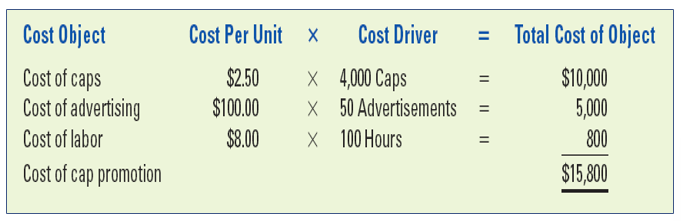

## Estimated vs Actual Cost (Decision Making)

Estimated Costs:
- used by managers to make decisions about the future
- windshield

Actual Costs:
- Knowledge of actual costs (after the fact) may or may not be useful for planning & decision making
- Rearview mirror

> Estimates are imperfect but necessary to make future focused decisions

Assume drivers and data chosen are relevant and central to business decision will enable solid projections

**Time vs Accuracy**
- Tradeoff: time needed to gather data for decision
  - accuracy 
  - diminishing window of opportunity for activating decision

## Direct vs Indirect Costs

Direct: can be traced to cost objects in a cost-effective manner
- Manuf ex: Direct Materials & Direct Labor

Indirect: can NOT be traced to cost objects in a cost-effective manner
- Manuf ex: overhead (utils, mgmt salary, property taxes, depreciation)

Case Study: Merch Biz pays bonus to dept mgr based on dept sales
- Incentive: inc dept sales
- BUT: not dept profits
- Decision: future bonuses will be based on profitability for 3 dept
- Requires: agreeable method to calculate profit for all 3 dept

How can Sales can increase while Profits decrease?
- lower pricing
- higher costs

Essentially: 
- develop 3 income statements
- measure profitability based on breakdown

> "Product P&L" (profit and loss statements)

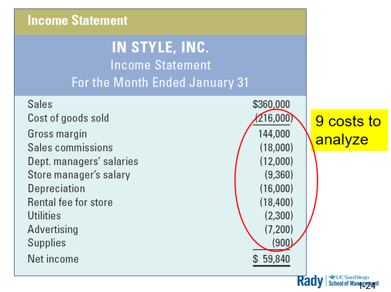

Direct/Indirect is independent of Fixed/Variable 

Aggregate(store manager salary) is indirect to any one department
but individual store manager salaries are direct in regards to their store(s)

## Allocating Indirect Costs to departments

- Determine Cost Driver
- Determine Allocation Rate
- Determine Allocation Weight (% total)
- Allocate (= weight * rate)

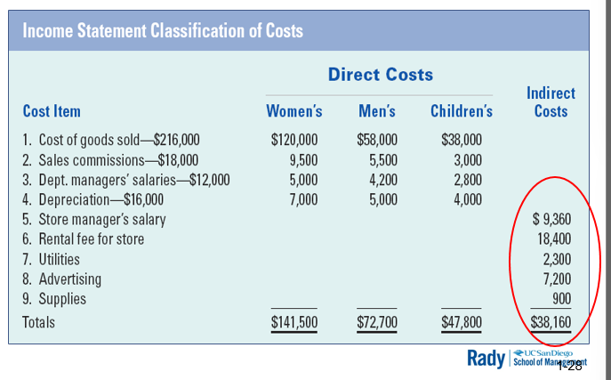

Select the most appropriate cost driver for each indirect cost
- allocation should reflect how much each department consumes that resource

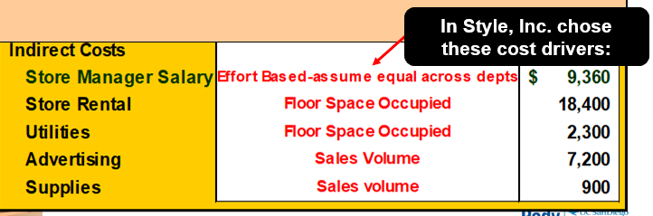

Allocation rate = (total cost) / (cost driver activity)

Allocated cost = (Allocation rate) x (weight of cost driver activity)

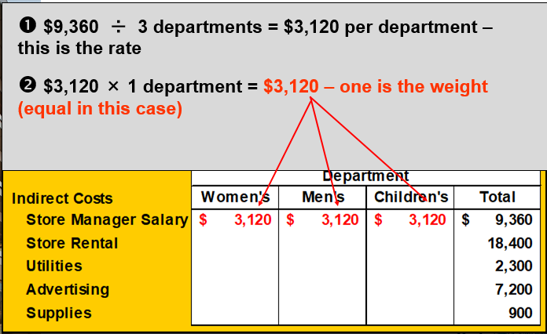

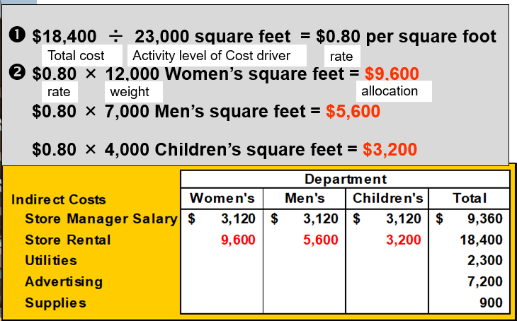

similarly allocated Utilies

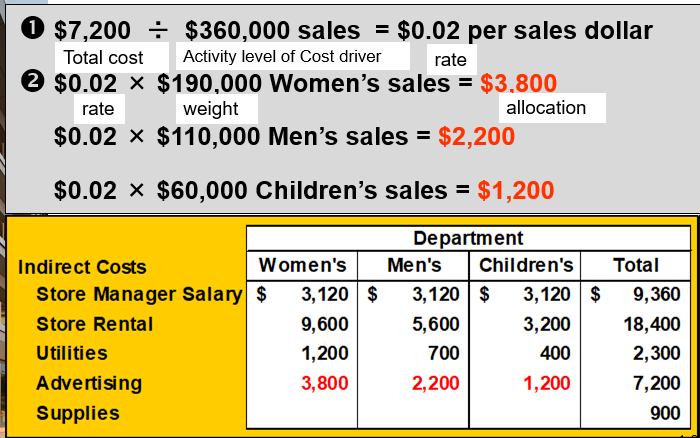

similarly allocated Supplies

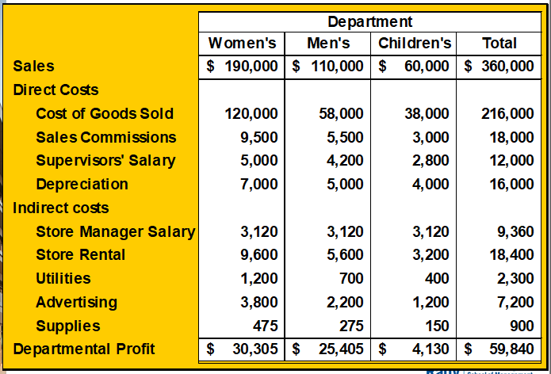

> Which cost driver is most directly related to use of resources?
> 
> Availability and cost of information are important
> 
> Follow the resource usage

## Establishing Cost Pools

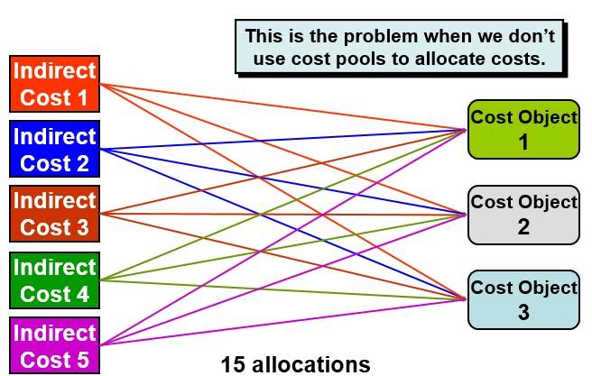

We did the first (super graular) extreme in the prev example

The other extreme loses a lot of granularity:

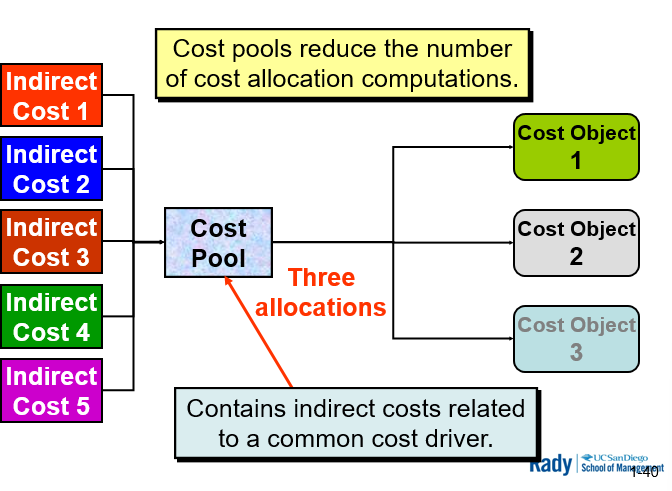

What about a middle ground?

Combine costs with similar/same cost drivers.

### Example Problem:

Expectation: incur $450K in manuf overhead cost in 2017

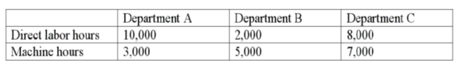

Req:
- Using direct labor hours as cost driver to compute allocation rate. Determine budgeted overhead ocst for each dept

- Using machine hours as cost driver to compute allocation, determine amt of budgeted overhead cost for each dept

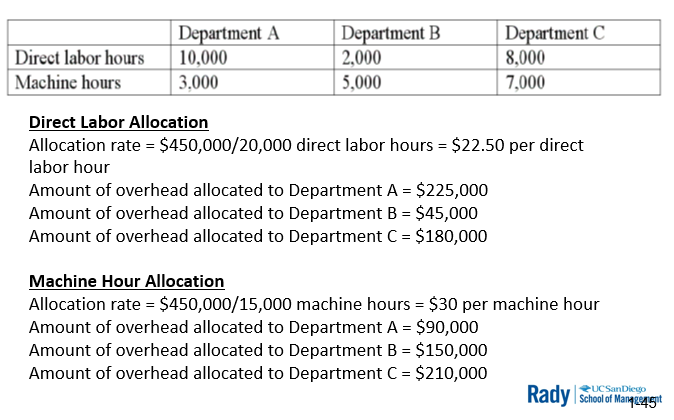